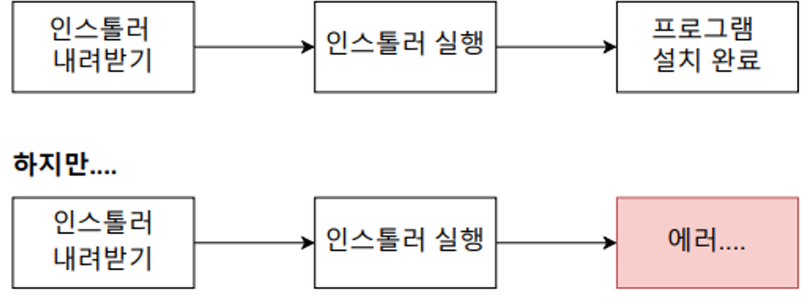
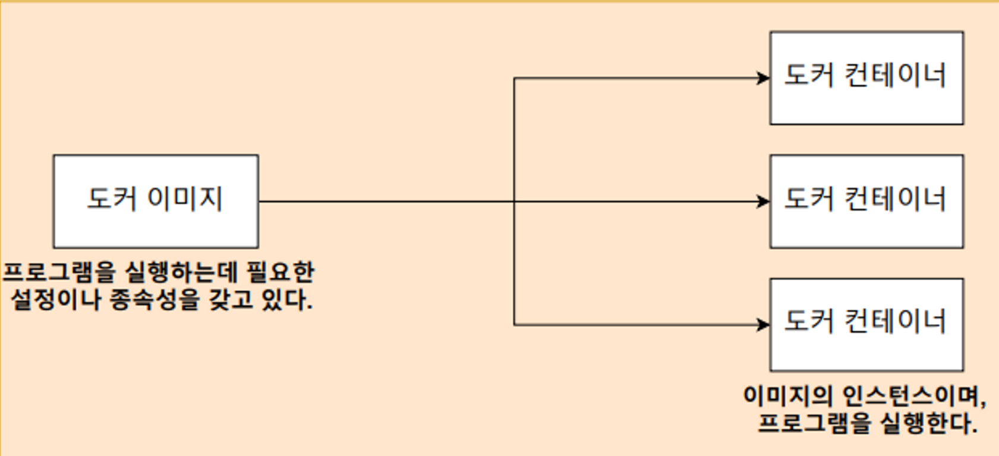
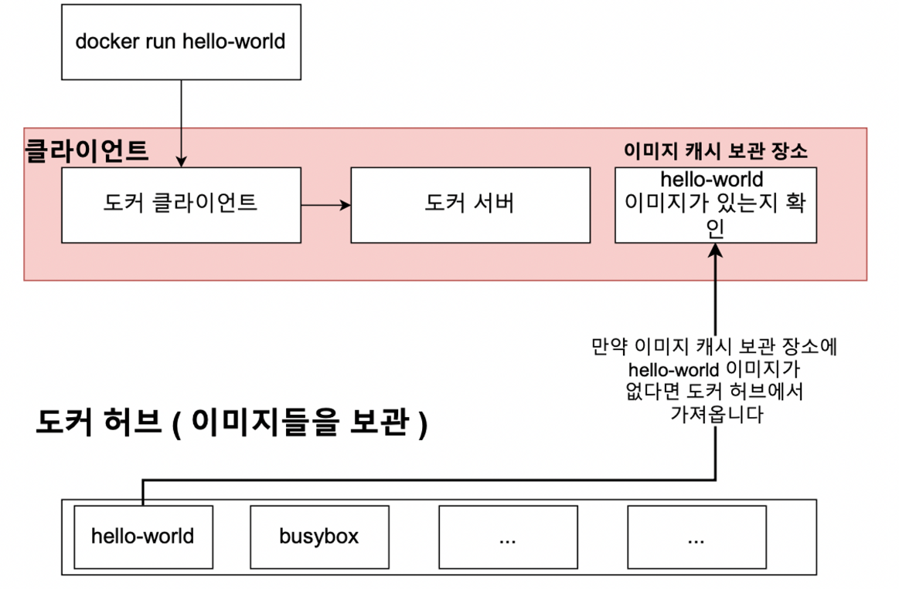
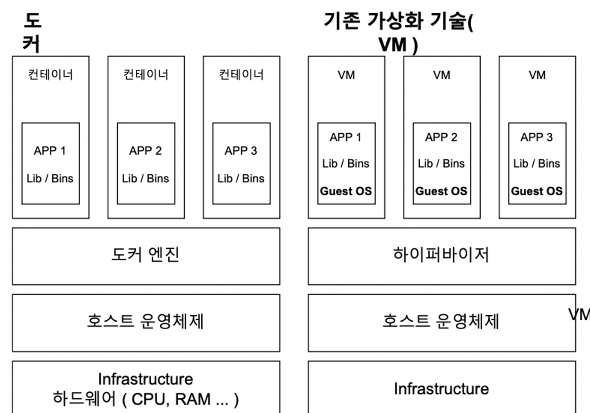
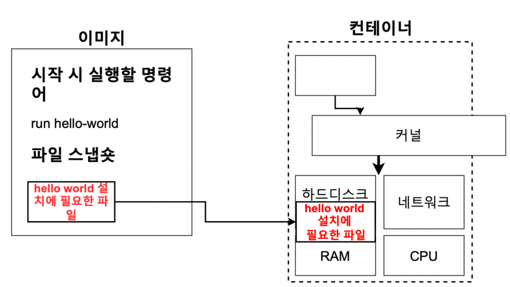
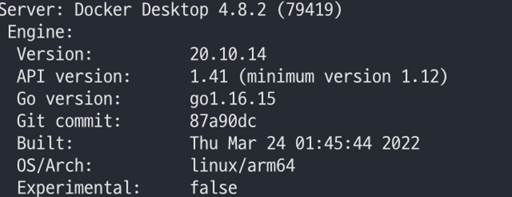
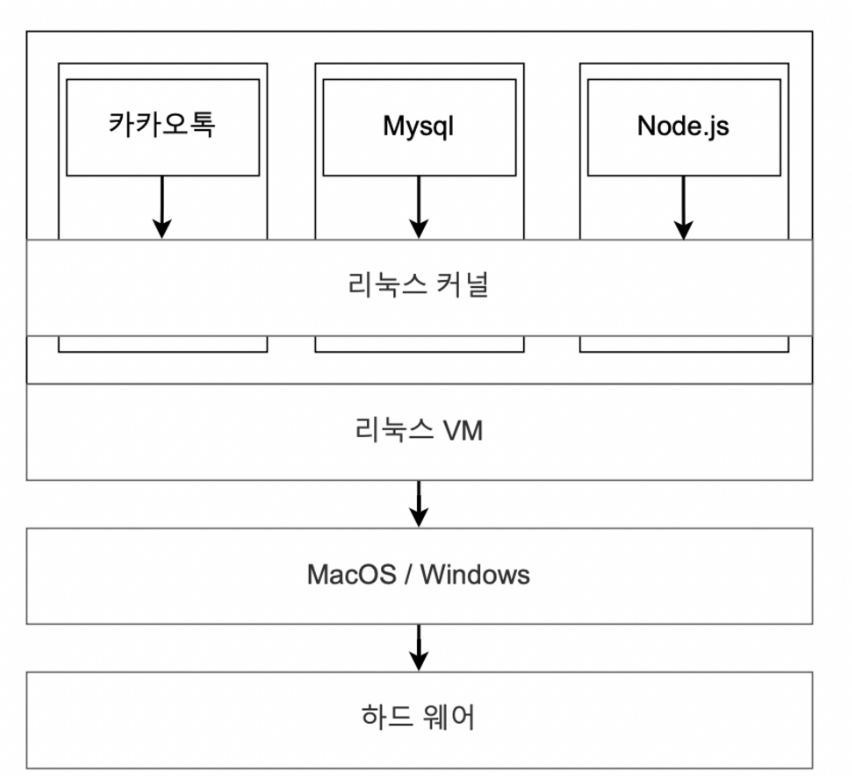

# 사용이유

- 결론부터 말하자면 어떠한 프로그램을 다운로드하는 과정을 굉장히 간단하게 만들기 위해서
  
  

- 갖고 있는 서버, 패키지 버전, 운영체제 등등에 따라 프로그램을 설치하는 과정 중에 많은 에러가 발생함.
- 설치 과정도 다소 복잡해짐

## 도커 있을 때 없을 때 차이점

- **Redis를 받는 과정**
  - Redis홈체이지 이동 → wget http://…… → wget 없어서 받은 후 다시 Redis를 받아야됨
  - 위와 같은 식으로 특정 프로그램을 받을 때 거기에 맞는 부수적인 것들도 계속 받으면서 설치하는 과정이 복잡해짐
- **Docker 사용하여 Redis 받는 과정**
  - `docker run -it redis` → 끝


# 도커란?

- 컨테이너를 사용하여 응용프로그램을 더 쉽게 만들고 배포하고 실행할 수 있도록 설계된 도구, 컨테이너 기반의 오픈소스 가상화 플랫폼이며 생태계

## 컨테이너란?

- 컨테이너 안에 다양한 프로그램, 실행환경을 컨테이너로 추상화하고 동일한 인터페이스를 제공하여 프로그램의 배포 및 관리를 단순하게 해줌
- 코드와 모든 종속성을 패키지화 하여 응용프로그램이 한 컴퓨팅 환경에서 다른 컴퓨팅 환경으로 빠르고 안정적으로 실행되도록 하는 소프트웨어의 표준 단위
- 간단하게 편리하게 프로그램을 실행시켜주는 것

## 컨테이너 이미지란?

- 코드, 런타임, 시스템 도구, 시스템 라이브러리 및 설정과 같은 응용프로그램을 실행하는 데 필요한 모든 것을 포함하는 가볍고 독립적이며 실행 가능한 소프트웨어 패키지
- **컨테이너 이미지**는 `런타임에 컨테이너`가 되고 **도커 컨테이너**의 경우 `도커 엔진에서 실행될때 이미지가 컨테이너`가 된다.



- 컨테이너는 **소프트웨어를 환경으로부터 격리**시키고 개발과 스테이징의 차이에도 불구하고 균일하게 작동하도록 보장한다.

### 정리

- **도커 이미지**는 프로그램을 실행하는데 필요한 설정이나 **종속성**을 갖고 있으며 도커 이미지를 이용해서 **컨테이너를 생성**하며, 도커 컨테이너를 이용하여 프로그램을 실행한다.

### 도커 흐름

1. 도커 CLI에 커멘드를 입력한다
2. 도커 서버에서 그 커멘드를 받아서 이미지를 생성하든 컨테이너를 실행하든 한다.

```jsx
docker run hello-world
```

- CLI입력 후, 도커 서버에 요청을 보낸다.
- 서버에서 hello-world라는 이미지가 로컬에 cash되어있는지 확인
- 없으면 Unable to find image~ 라는 문구가 뜨면서 Docker Hub이라는 이미지가 저장되어있는 곳으로 가서 이미지를 가져오고 로컬 cash에 보관

    

- 이제는 hello-world를 실행하면 Unable to find image~ 문구가 안뜸

### 컨테이너의 이해

- **가상화 기술이 나오기 전**에 한대의 서버를 한개의 용도로만 사용
- 남는 서버 공간 방치, 하나의 서버에 하나의 운영체제 하나의 프로그램만 운영, 안정적 But 비효율
- **하이퍼 바이저 기반의 가상화** 출현으로 논리적 공간을 분할하여 VM이라는 독립적인 가상 환경의 서버 이용 가능
- **하이버 바이저**는 호스트 시스템에서 다수의 게스트 OS를 구동할 수 있게 하는 소프트웨어, 하드웨어를 가상화하면서 하드웨어와 각각의 VM을 모니터일 하는 중간 관리자.


- 하이버바이저에 의해 구동되는 VM은 각 VM마다 독립된 가상 하드웨어 자원을 할당받음

- 논리적으로 분리되어 있어서 한 VM에 오류가 발생해도 다른 VM으로 퍼지지 않는다.

- **도커는 이러한 가상화 기술에서 나온 컨테이너 가상화 기술**
  
  

- VM과 비교했을때 컨테이너는 하이퍼바이저와 게스트 OS가 필요하지 않음
- **컨테이너 방식**은 호스트OS위에 애플리케이션의 실행 패키지인 이미지를 배포하기만 하면되는 방식
- **VM**은 애플리케이션을 실행하기 위해서 VM을 띄우고 자원을 할당한 다음, 게스트 OS를 부팅하여 애플리케이션을 실행하야되기 때문에 복잡하고 무거움

**공통점**

- 도커 컨테이너와 가상머신은 기본 하드웨어에서 **격리된 환경**내에 애플리케이션을 배치하는 방법

**차이점**

- 가장 큰 차이점은 격리된 환경을 얼마나 격리를 시키는지의 차이

**정리**

- **도커 컨테이너**에서 돌아가는 애플리케이션은 컨테이너가 제공하는 격리 기능 내
  부에 샌드박스가 있지만, **여전히 같은 호스트**의 다른 컨테이너와 동일한 커널
  을 공유한다. 결과적으로, 컨테이너 내부에서 실행되는 프로세스는 **호스트 시스
  템(모든 프로세스를 나열할 수 있는 충분한 권한있음)에서 볼 수 있다**. 예를 들어, 도커와 함께 몽고DB 컨테이너를 시작하면 호스트(도커가 아님)의 일
  반 쉘에 ps-e grep 몽고를 실행하면 프로세스가 표시된다. 또한, 컨테이너가 전체 OS를 내장할 필요가 없는 결과, 그것들은 매우 가볍고, 일반적으로 약 5-100 MB이다.

- **가상 머신**과 함께 VM 내부에서 실행되는 모든 것은 호스트 운영 체제 또는 하이
  퍼바이저와 독립되어 있다. 가상 머신 플랫폼은 특정 VM에 대한 가상화 프로세
  스를 관리하기 위해 프로세스를 시작하고, 호스트 시스템은 그것의 하드웨어 자
  원의 일부를 VM에 할당한다. 그러나 VM과 근본적으로 다른 것은 시작 시간에
  이 VM 환경을 위해 새롭고 이 특정 VM만을 위한 커널을 부팅하고 (흔히 다소
  큰) 운영 체제 프로세스 세트를 시작한다는 것이다. 이것은 응용 프로그램만 포
  함하는 일반적인 컨테이너보다 VM의 크기를 훨씬 크게 만든다. OS까지 가상화... 맥에서 윈도우를 깐다든지 리눅스에서 윈도우를 돌린다든지... 이러한 방법은 비교적 사용법이 간단할 수 있지만 굉장히 느리다.

- 리눅스 C group : 어떤 애플리케이션의 사용량이 많아지면, C group에 집어 넣어서 CPU와 메모리 사용 제한 가능하게 해주는 것

- 리눅스 네임스페이스 : 하나의 시스템에서 프로세스를 격리시킬 수 있는 가상화 기술, 별개의 독립된 공간을 사용하는 것처럼 격리된 환경을 제공하는 경량 프로세스 가상화 기술


## 이미지로 컨테이너를 만들기

- **이미지**는 응용 프로그램을 실행하는데 `필요한 모든 것`을 포함하고 있다
- **필요한 모든 것** : 컨테이너가 시작될 때 실행되는 명령어, 파일 스냅숏(디렉터리나 파일을 카피한 것)

### 이미지로 컨테이너 만드는 순서

1. Docker 클라이언트에 docker run <이미지>를 입력해준다.
2. 도커 이미지에 있는 파일 스냅샷을 컨테이너 하드 디스크에 옮겨 준다.



3. 이미지에서 가지고 있는 명령어 ( 컨테이너가 실행될 때 사용될 명령어)를 이용해서 카카오톡을 실행시켜준다.

### Cgroup, 네임스페이스를 쓸수 있는 이유

- 컨테이너를 격리시킬 수 있는 이유는 Cgroup과 네임스페이스를 이용하기 떄문
- 하지만 Cgroup과 네임스페이스은 리눅스에서만 가능


- docker version





- 내 PC는 MAC OS인데 Docker Server는 linux이다.
- 중간에 리눅스 VM이 있다
