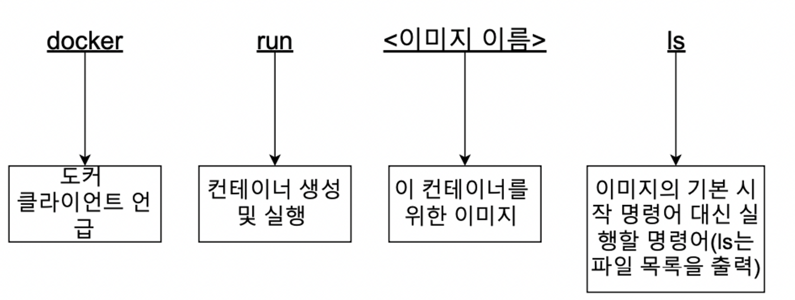

**docker run hello-world 작동 순서**

1. 도커 클라이언트에 명령어 입력 후 도커 서버로 보낸다.
2. 도커 서버에서 컨테이너를 위한 이미지가 이미 캐쉬가 되어 있는지 확인
3. 없으면 도커 허브에서 다운 받고 이미 있으면 이미지로 컨테이너 생성

**이미지로 컨테이너 생성하는 순서**

1. 시작 명령어 입력 ( run hello-world )
2. 파일 스냅샷을 컨테이너 하드디스크에 넣어줌, 명령어도 넣어줌
3. 명령어를 작동시키면, 커널을 통해서 필요한 프로세스를 실행 시켜줌

## 이미지 내부 파일 시스템 구조 보기

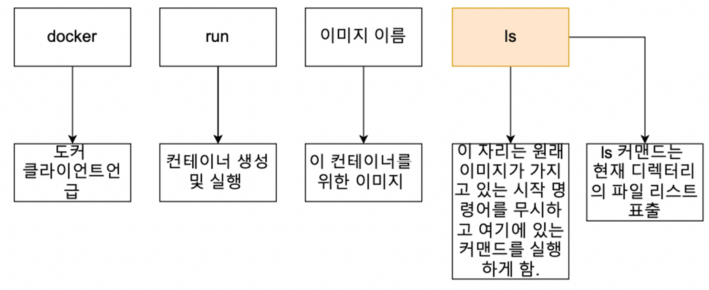

`docker run alpine ls`

1. Alpine 이미지를 이용해서 컨테이너를 생성
2. 생성할 때 Alpine 이미지 안에 들어있던 파일 스냅샷들( bin, dev, etc등)이 컨테이너 안에 있는 **하드디스크**로 다운로드 됨
3. 이미지 이름 뒤에 다른 명령어를 더 붙여서 원래 이미지 안에 들어있는 기본 커맨드는 무시가 되고 ls 명령어가 실행됨.

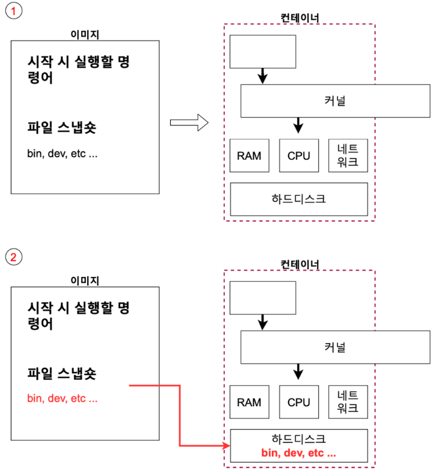

- Apline 이미지를 이용해 ls 명령어를 실행 어케 가능?
  - hello-world 이미지로는 불가
  - 실행할 수 있는 파일을 못 찾음
  - 파일 스냅샷으로 하드디스크에 들어온 파일들로 인해 명령어를 실행가능 할 수 있는 것들이 있고 없는 것들이 있다.

## 컨테이너들 나열하기

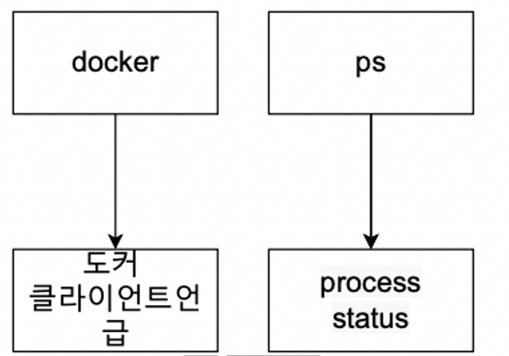

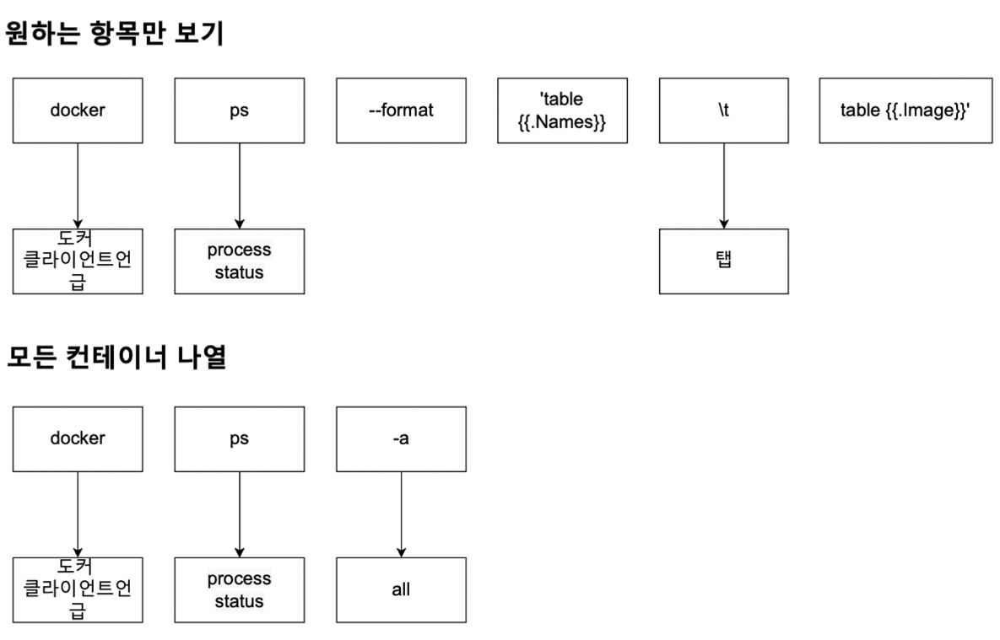

## 도커 컨테이너의 생명 주기

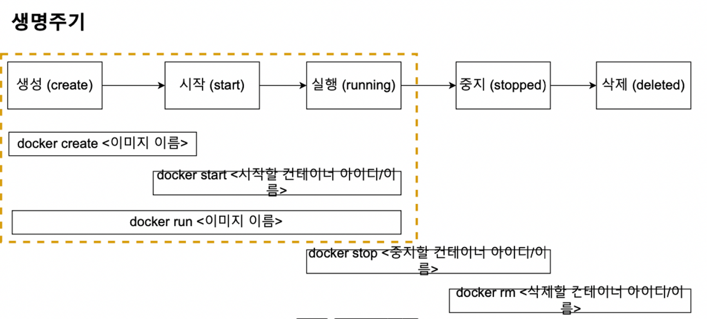

- 지금까지 docker run <이미지 이름>으로 컨테이너 생성 실행했는데 이걸 docker create와 docker start으로 쪼개서 보자

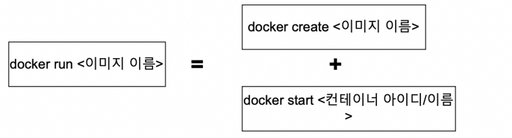

- `docker create hello-world`
- id : adasd1w123asdawe
- `docker start -a adasd1w`
- -a → attach, -a 옵션이 없이 start를 하게 되면 id만 출력하게된다.

## docker stop vs docker kill

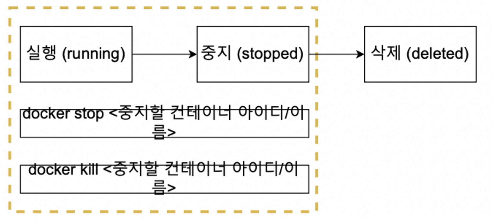

### Stop과 Kill 차이

- 공통점은 둘 다 실행중인 컨테이너를 중지시킨다.
- **Stop**은 Gracefully 하게 중지 시킨다. 자비롭게 그 동안 하던 작업들을( 메시지를 보내고 있다면 메시지를 보낸 후) 완료하고 컨테이너를 중지시킨다.

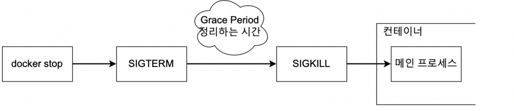

- Kill 같은 경우는 Stop과 달리 어떠한 것도 기다리지 않고 바로 컨테이너를 중지 시킨다.

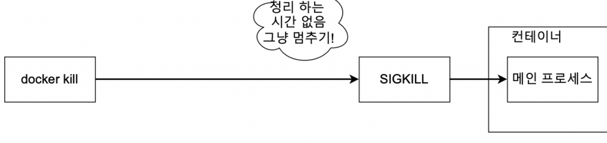

## 컨테이너 삭제하기

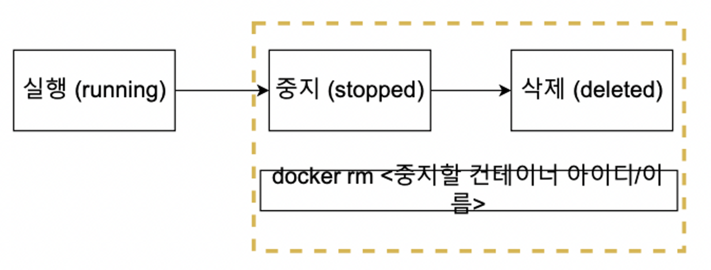

- 기본적으로 rm 명령어는 중지한 상태인 것들만 삭제 가능

`docker ps -a`

—> 중단 되어있는 도커들 목록도 다 나옴

`docker rm id`

—> 삭제

- 모든 컨테이너를 삭제

`docker rm 'docker ps -a -q'`

- 이미지를 삭제

`docker rmi <이미지 id>`

- 한 번에 사용하지 않는 컨테이너, 이미지, 네트워크 모두 삭제하려면

`docker system prune`

## 실행 중인 컨테이너에 명령어 전달

1. `docker run alpine ping localhost`
   - 일단 하나 실행 시켜놓고
2. `docker exec <id> ls`
   - apline이 ping을 계속 보내는 와중에 다른쪽에서 ls 명령어 수행

## 레디스를 이용한 컨테이너 이해

1. `docker run redis`
2. 두 번째 터미널을 켜서 레더스 클라이언트를 작동시킨다.
   - redis-cli
3. 에러가 난다

—> **이유는 레디스 클라이언트가 레디스 서버가 있는 컨테이너 밖에서 실행을 하려 하니 레디스 서버에 접근을 할 수가 없기 때문**

- 따라서 exec이라는 명령어를 사용하자

`docker exec -it <id> redis-cli`

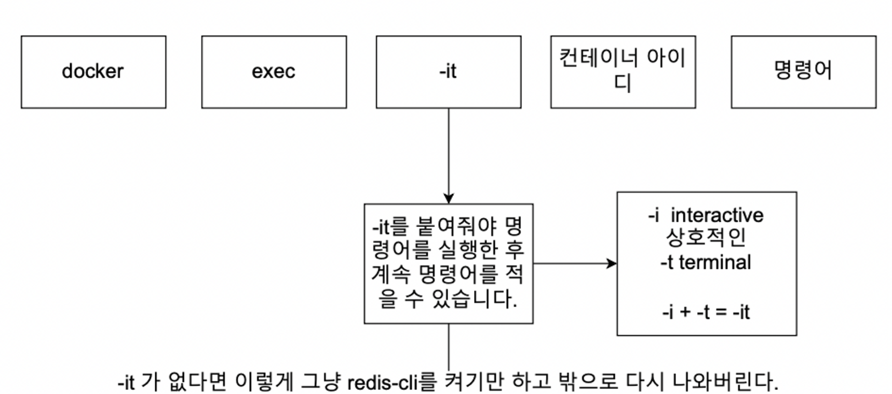

## 실행 중인 컨테이너에서 터미널 들어가기

- ls 명령어 대신 sh 명령어 사용
- 터미널 환경에서 나오려면 `control + D`
