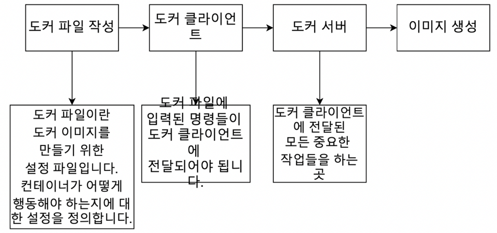
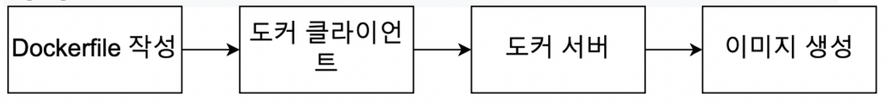
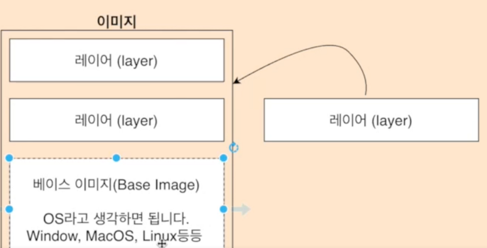
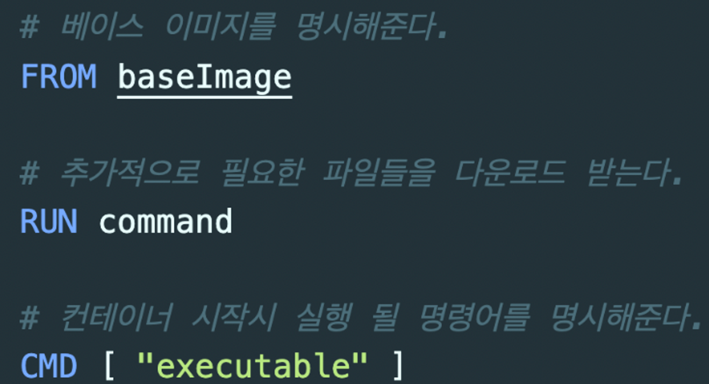
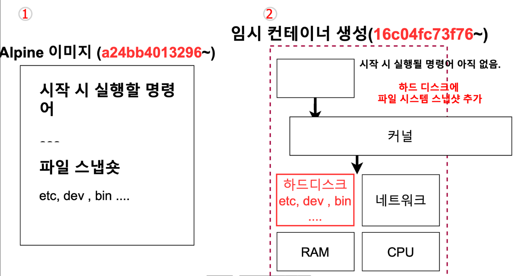
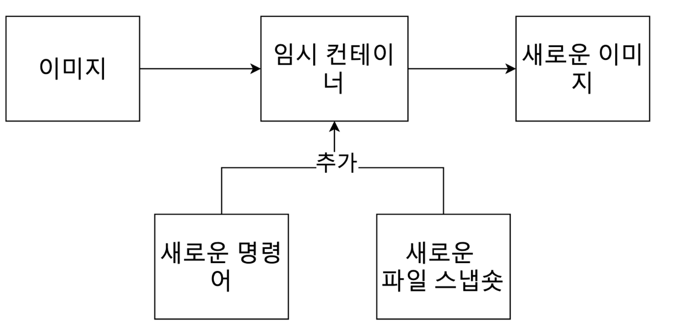
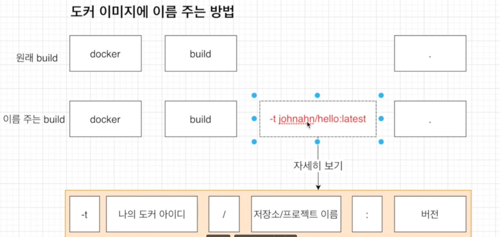

# 도커 이미지 만들어 보기

## 도커 이미지 생성하는 순서

- 현재까지는 도커 이미지를 항상 도커 허브에 이미 있던 것들만 가져왔다

- **도커 이미지를 이용해서 도커 컨테이너를 생성**
  
  `docker create <이미지 이름>`

- **Dockerfile을 만드는 법**
  
  

## Dockerfile 만들기

### 도커 파일(Docker file)이란?

- 도커 이미지를 만들기 위한 설정 파일이며, 컨테이너가 어떻게 행동해야 하는지에 대한 설정들을 정의해 주는 곳이다.

### 도커 파일 만드는 순서

1. **베이스 이미지**를 명시해준다. (파일 스냅샷에 해당)
2. 추가적으로 필요한 파일을 다운 받기 위한 몇 가지 명령어를 명시해준다.(파일 스냅샷에 해당)
3. 컨테이너 시작시 실행될 명령어를 명시해 준다.
- 시작시 실행될 명령어
  - run kakaotalk
- 파일 스냅샷
  - 카카오톡 파일

### 베이스 이미지란?

- 도커 이미지는 여러 개의 레이어들로 되어 있다. 그 중에서 베이스 이미지는 이 이미지의 기반이 되는 부분이다.
- 만약 이 이미지에 무엇인가 추가한다면, 아래 보이는 레이어 사이에 추가가 된다. (레이어 캐싱)

### 순서

1. 도커 파일을 만들 폴더 하나 생성
2. 파일 하나를 생성, 이름은 Dockerfile
3. 그 안에 어떻게 진행해 나갈지 기본적인 토대를 명시
   
   
- **FROM** : 이미지 생성지 기반이 되는 이미지 레이어이다.
  
  - <이미지 이름>:<태그> 형식으로 작성
  - 태그를 안붙이면 자동적으로 최신 것을 다운로드 받음
    - ex) ubuntu:14.04

- **MAINTAINER** : 메인 테이너의 정보

- **VOLUME** : 디렉토리 내용을 컨테이너에 저장하지 않고 호스트에게 저장하도록 설정, 데이터 볼륨을 호스트의 특정 디렉토리와 연결하려면 docker 명령에서 -v옵션을 사용해야된다.
  
  ( ex. -v root/data/data)≠

- **RUN** : 도커 이미지가 생성되기 전에 수행할 쉘 명령령어

- **CMD** : 컨테이너가 시작되었을 때, 실행할 실행 파일 또는 셀 스크립트이다. 해당 명령어는 Dockerfile내에 1회만 사용가능
1. 이제 베이스 이미지부터 실제 값으로 추가해주기.

2. 베이스 이미지는 ubuntu를 써도 되고 centos 등을 써도 되지만 hello를 출력하는 기능은 굳이 사이즈가 큰 베이스 이미지를 쓸 필요가 없기에 사이즈가 작은 alpine 베이스 이미지를 사용.

3. hello 문자를 출력해주기 위해 echo를 사용하여야 하는데 이미 alpine 안에 echo를 사용하게 할 수 있는 파일이 있기에 RUN 부분은 생략함.

## 도커 파일로 도커 이미지 만들기

- 도커 파일에 입력된 것들이 도커 클라이언트에 전달되어서 도커 서버가 인식하게 해야된다.
- `docker build ./` 또는 `docker build .`
- **Build 명령어란?**
  - 해당 디렉토리 내에서 dockerfile이라는 파일을 찾아서 도커 클라이언트에 전달시켜준다.
  - docker build 뒤에 ./ 와 . 는 둘 다 현재 디렉토리를 가리킨다.

## build 과정 설명

1. alpine 이미지 가져오기 ( id : a24bb )
2. 임시 컨테이너 생성 후 그 컨테이너에 시작 시 사용할 명령어 포함시키기, 그런 후 방금 생성한 임시컨테이너를 지우고 새로운 이미지 만들기

- 베이스 이미지(FROM alpin)를 먼저 임시 컨테이너에 넣어주고, 베이스 이미지 이외에도 설정한 레어이들을 넣어준다. 그 임시 컨테이너를 토대로 새로운 이미지가 생성이 된다.

## 결론

- 베이스 이미지에서 다른 종속성이나 새로운 커맨드를 추가할 때는 임시 컨테이너를 만든 후 그 컨테이너를 토대로 새로운 이미지를 만든다. 그리고 그 임시 컨테이너는 지워준다.

- 이미지를 통해 컨테이너를 만들고, 컨테이너를 통해 다시 새로운 이미지를 만든다.

### 도커 이미지에 이름 주는 법

- `docker build -t eldehd9898/hello:latest ./`
- -t 는 tag의 의미
