# 도커를 이용한 간단한 Node.js 어플 만들기

## Node.js 앱 만들기

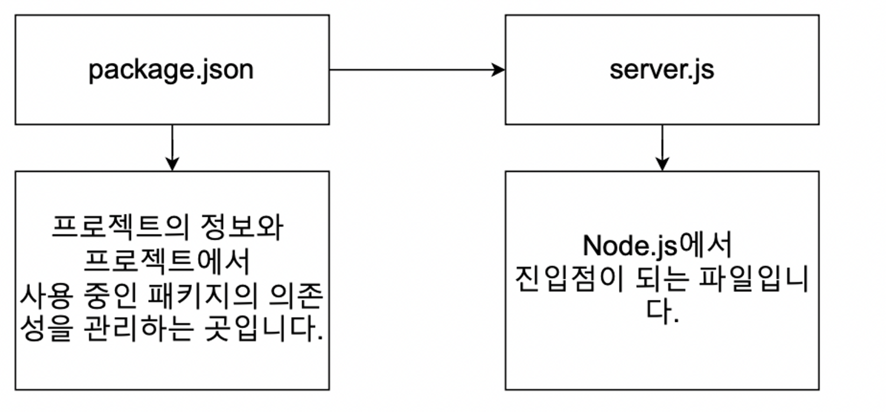

## Dockerfile 작성하기

- Nodejs 앱을 도커 환경에서 실행하려면 먼저 이미지를 생성하고 그 이미지를 이용해서 컨테이너를 실행한 후 그 컨테이너 안에서 Nodejs 앱을 실행시켜야된다. 그래서 이미지를 먼저 생성하려면 Dockerfile을 먼저 작성해야된다.

```docker
FROM node:10

RUN npm install

CMD ["node","server.js"]
```

- Package.json파일이 없다고 뜨고 에러남

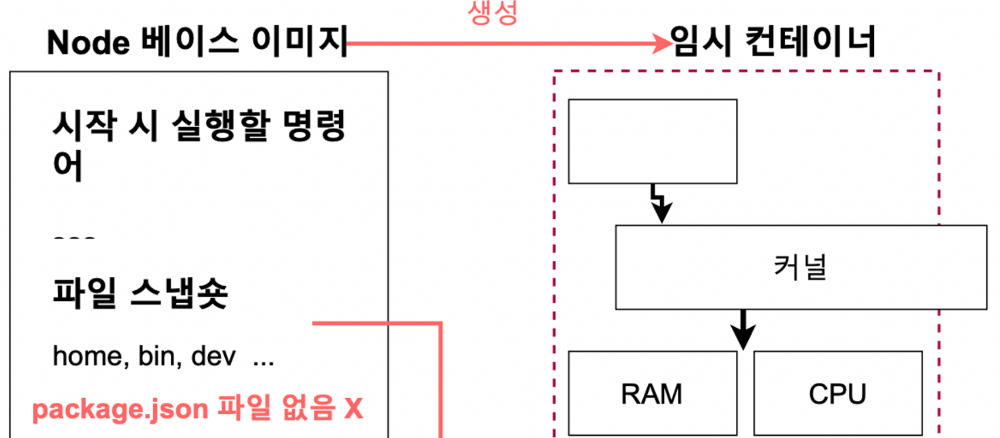

- 베이스 이미지로 임시컨테이너를 만들고 임시 컨테이너 안에서 npm install을 하는데 임시컨테이너 안에는 Package.json과 server.json이 없다.( 컨테이너 밖에 있는 상황 )
- 이러한 이유 때문에 **COPY를 이용해서 Package.json을 컨테이너 안으로 넣어주어야 한다.**

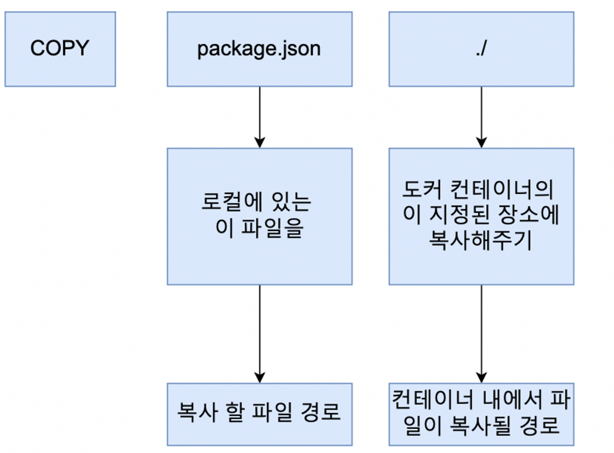

```docker
FROM node:10

COPY package.json ./

RUN npm install

CMD ["node","server.js"]
```

- RUN위에 해줘야 되는 이유가, npm install하기 전에 파일이 있어야 되기 떄문
- 하지만 build하고나서 run을 하게 되면 에러가 난다.

```docker
FROM node:10

COPY ./ ./

RUN npm install

CMD ["node","server.js"]
```

- server.js도 찾지 못해서이다. 따라서 ./ 를 통해 해결한다.


## 생성한 이미지로 애플리케이션 실행 시 접근이 안되는 이유(포트 맵핑)

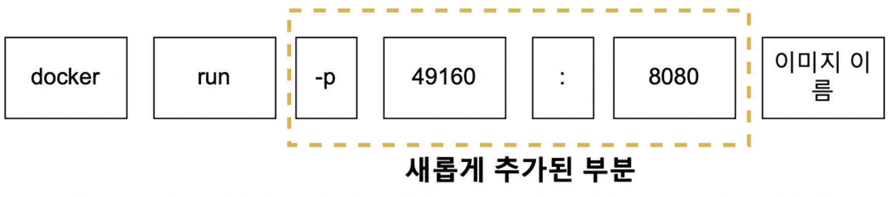

- -p는 port이고 49160은 내 로컬에서 실행할 port번호, 8080은 docker 서버에서 실행되고있는 port번호이다. 그래서 로컬에서는 49160으로 포트를 잡아줘서 실행하면 된다.


## WORKING DIRECTORY 명시해주기

- WORKING DIRECTORY : 이미지 안에서 애플리케이션 소스 코드를 가지고 있을 디렉터리를 생성하는 것
- `docker run -it eldehd9898/nodejs ls`

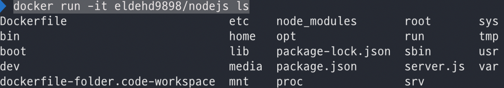

- 여기 파일 중에서 COPY를 해서 컨테이너 안으로 들어온 것들

**문제점**

1. 이 중에서 원래 이미지에 있던 파일과 이름이 같다면?
   - 기존에 있는 폴더가 중복되면 덮어 써져 버림.
2. 깔끔하지 못함

```docker
FROM node:10

WORKDIR /usr/src/app

COPY ./ ./

RUN npm install

CMD ["node","server.js"]
```

- build 후 `docker run -it eldehd9898/nodejs sh`
- WORKDIR 설정 후 터미널에 들어오면 기본적으로 work 디렉터리에서 시작하게 된다.

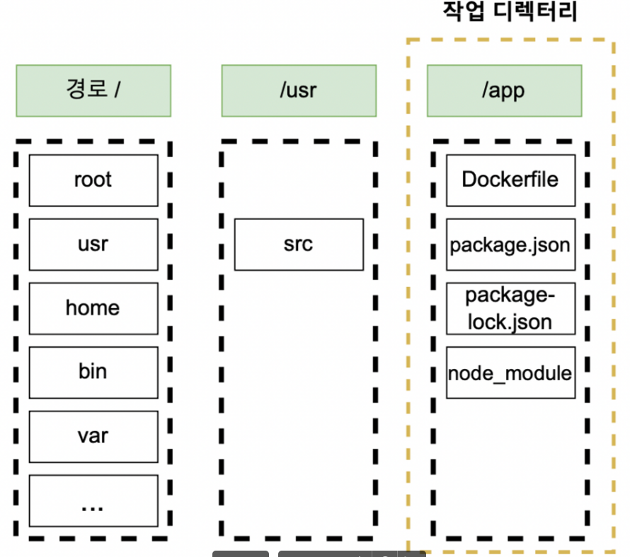

## 어플리케이션 소스 변경으로 다시 빌드하는 것에 대한 문제점

- 소스를 변경할 때마다 빌드를 해야되는 문제가 있는데, 도커를 이용해서 어떻게 실시간으로 소스가 반영되게 하는지 보자

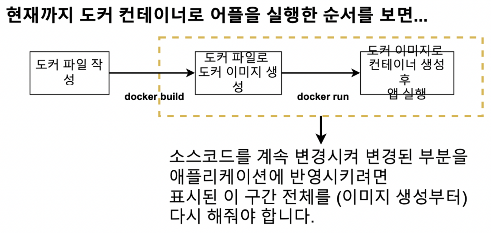

1. 도커 파일 작성

2. docker build

3. 이미지 생성

4. 이미지로 컨테이너 생성 후 앱 실행

5. 소스변경후 2번과정부터 다시 해야됨…..
- `COPY ./ ./` 이 부분으로 인해서 소스를 변화시킨 부분은 server.js 뿐인데 모든 node_module에 있는 종속성들까지 다시 받아줘야 된다.


## 어플리케이션 소스 변경으로 재 빌드시 효율적으로 하는 법

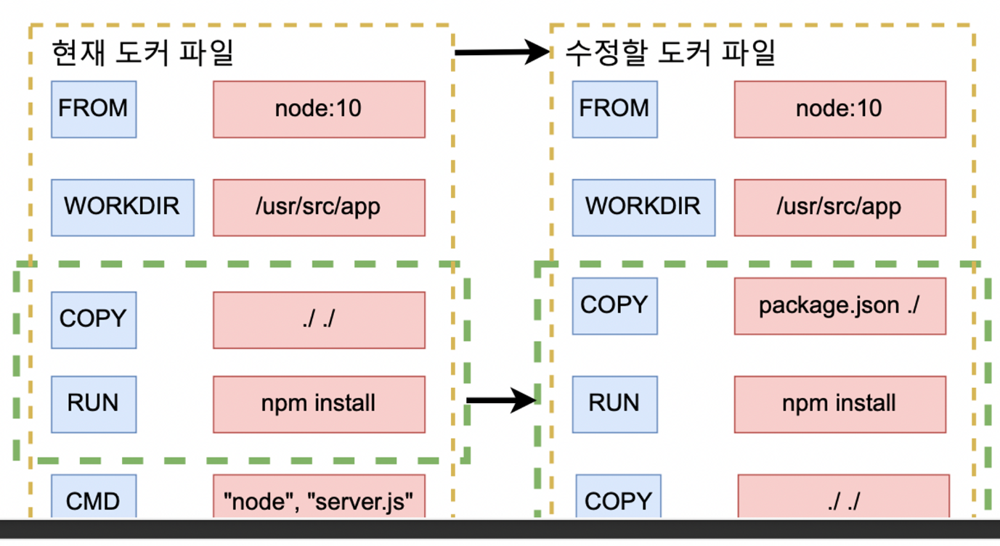

- 완성본 Dockerfile에는 RUN위에 COPY **package.json ./** 이 하나가 추가되고 원래의 COPY가 RUN 아래로 내려갔다.
- npm install 할 때 불필요한 다운로드를 피하기 위해서이다. 모듈의 변화가 생기면 다시 받게 되는데 기존에는 **COPY ./ ./** 이런식으로 되어있으니 server.js가 변경되도 package.json을 다시 받게 되는것이다. ( cashing )


## Docker Volume에 대하여

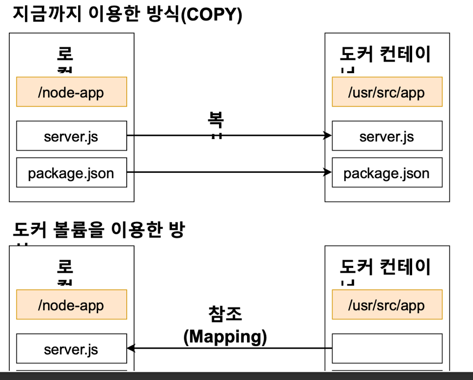

- 기존 COPY는 로컬에서 도커컨테이너로 파일들을 복사했다
- 도커 볼륨을 이용하면 도커 컨테이너에서 로컬쪽으로 참조(Mapping)를 할수있다.


### Volume 사용해서 어플리케이션 실행하는 법

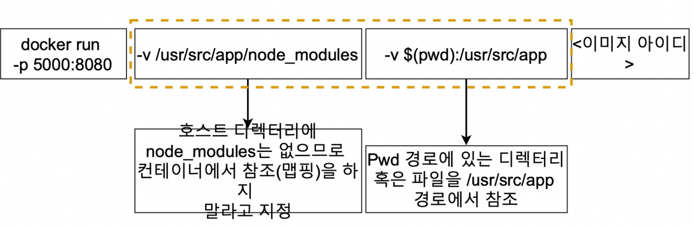

- `-v /usr/src/app/node_modules` 는 현재 로컬 디렉토리에 node_modules가 없으므로 컨테이너에서 참조(매핑)하지 말라고 지정
- `-v $(pwd):/usr/src/app` 는 : 를 기준으로 왼쪽에는 로컬 현재 디렉토리 오른쪽은 컨테이너 디렉터리에서 참조하라는 것

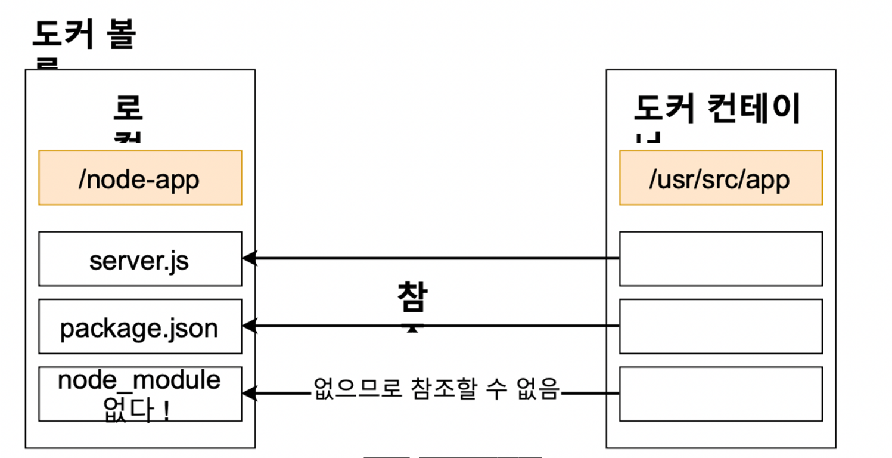
