# 개념 및 구조 이해

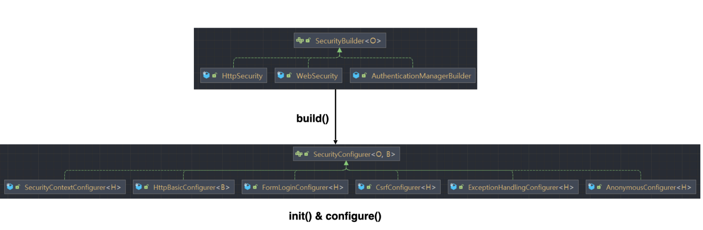

- `SecurityBuilder` 는 빌더 클래스로서 웹 보안을 구성하는 빈 객체와 설정클래스들을 생성하는 역할을 하며 `WebSecurity, HttpSecurity`가 있다.
- `SecurityConfigurer` 는 Http 요청과 관련된 보안처리를 담당하는 **필터들을 생성**하고 여러 초기화 설정에 관여한다.
- `SecurityBuilder` 는 `SecurityConfigurer` 를 포함하고 있으며 인증 및 인가 초기화 작업은 `SecurityConfigurer`에 의해 진행된다.
- `SecurityBuilder` 클래스에는 build()라는 메소드가 있고 초기화 작업이 진행이 되면 자동호출에 의해 build()메소드 호출됨, 그리고 `SecurityConfigurer`에서 init() 과 configure() 메소드가 실행되고 필터들이 초기화 된다.

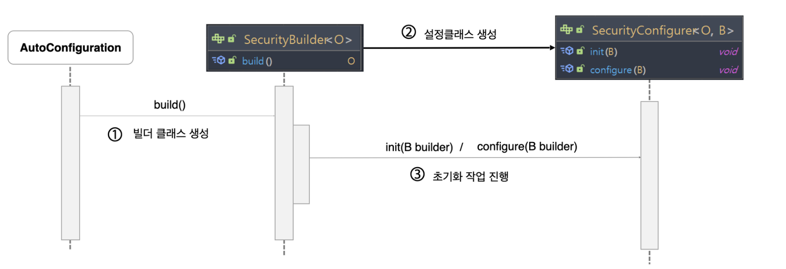

- AutoConfiguration 클래스 자동 설정에 의해 build()가 호출된다.
- 호출되는 과정에서 순서대로 클래스들이 호출되고 `SecurityConfigurer` 가 그 클래스들 사이에서 호출되어 init()과 configure() 가 실행된다.
- 결론 : `SecurityBuilder`가 `SecurityConfigurer`를 호출해서 실행시켜서 초기화 작업을 진행한다.

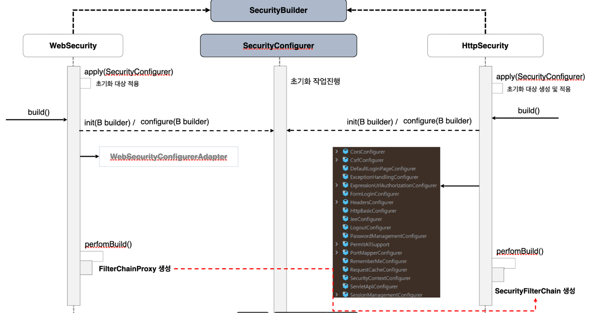

- `SecurityBuilder`에 대표적인 구현 클래스는 `WebSecurity` 와 `HttpSecurity`가 있다.
- WebSecurity가 먼저 초기화 작업을 한다.
- 두 개의 클래스에는 apply()메소드가 있는데 어떤 `SecurityConfigurer`를 초기화 대상 적용 시킨다.
- init 과 configure를 거치면서 filter들을 초기화 시킨다.
- 현재 버전에서는 `WebSecurityConfigureAdapter`가 deprecated가 됨
- 최종적으로 `WebSecurity`가 반환하는 거는 `FilterChainProxy`이다. `HttpSecurity`는 `SecurityFilterChain`을 생성한다.
- `FilterChainProxy`가 `SecurityFilterChain`의 값을 가지고 있다.

## CustomSecurityConfigurer 만들기

### 전반적인 과정 (디버그)

1. `WebSecurityConfiguration` (**SecurityBuilder 클래스의 구현체. 기본적으로 @Configuration 설정클래스임**) 먼저 171.Line 설정 클래스들을 가져와서 apply 해줌, apply 된 것들은 초기화 과정에서 init 과 configure 진행된다.
2. `HttpSecurityConfiguration` (**SecurityBuilder 클래스의 구현체. 기본적으로 @Configuration 설정클래스임**) prototype의 @Bean을 생성한다.

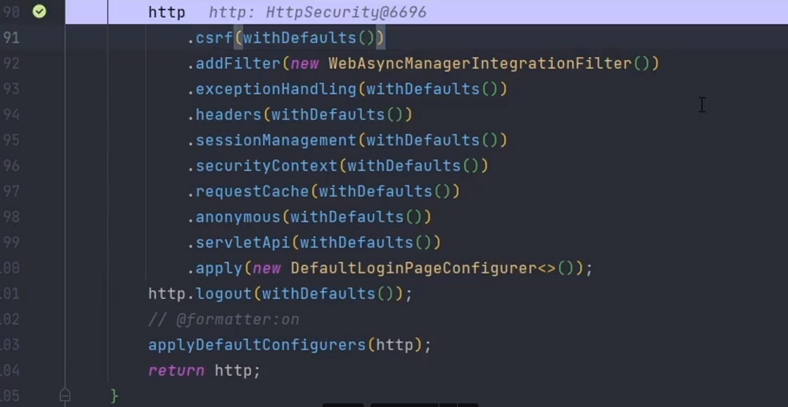

- 위의 API들은 각각의 설정클래스들의 구현체들을 생성하고 init과 configure 메소드를 실행할 수 있는 대상으로 지정하기 위한 과정.
3. SpringBootWebSecurityConfiguration 최종적으로 SecurityFilterChain 빈을 생성한다. SecurityFilterChain 클래스에서 위에서 반환했던 HttpSecurity를 주입 받는다.

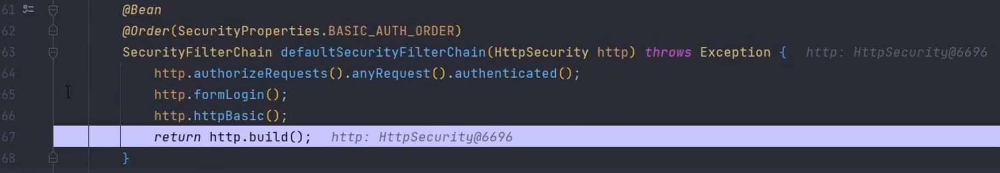

4. 67.Line에서 build메소드를 호출하면 실제로 이런 설정 클래스들이 초기화 될 수 있도록 과정들이 진행된다. AbstractSecurityBuidler 클래스의 build() → doBuild() → AbstractConfiguredSecurityBuilder 의 doBuild()

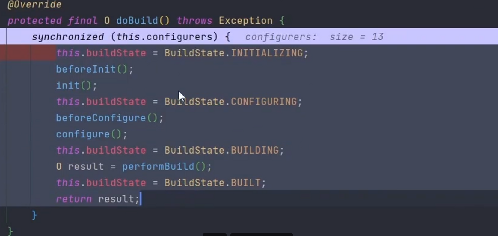

- init() 실제 구현체들이 가지고있는 init메소드 호출 (13개의 configure)

- configure() 위와같다.

- 최종적으로 performBuild()를 호출해서 `DefaultSecurityFilterChain`을 반환한다. 그래서 3번에서 return 값이 만들어 진 것이다.
5. 반환된 `SecurityFilterChain` 는 `WebSecurityConfiguration` 에서 @Autowired해서

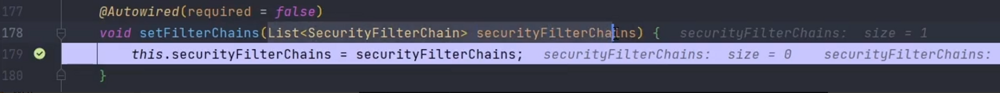

다시 websecurty.build() 를 하고 performBuild()를 통해 FilterChainProxy를 반환한다.

- 결론: `WebSecurity`와 `HttpSecurity` 를 통해 설정 클래스들이 만들어지고 init()과 configure() 메소드를 통해서 모든 설정 초기화 작업이 된다. 그리고 최종 산출물인 `SecurityFilterChain`객체(Bean)이 만들어지고 이 **Bean**을 최종적으로 사용하기 위한 클래스가 바로 `FilterChainProxy`이다. 그래서 FilterChainProxy를 리턴해서 `**SecurityBuilder**`를 완성한다. 그리고 이 Filter는 `“springSecurityFilterChain”` 이 이름으로 빈이 생선된다.

### 만들기

- 자동설정(기본적)으로 `SpringBootWebSecurityConfigureration`에서 만들고 있다.
- 기존에는 `public class SecurityConfig extends **WebSecurityConfigurerAdapter**`를 상속 받았었고 직접 인증 처리를 하였다
- 현재에는

```java
@Bean
SecurityFilterChain securityFilterChain(HttpSecurity http) {
    http.authorizeRequest().anyRequest().authenticated();
    http.formLogin();
    http.apply(new CustomSecurityConfigurer().setFlag(false)); --> (1)
    return http.build();
}
```

- 빈으로 등록하고 HttpSecuriy를 의존성 주입을 받는다. 기존과 비슷한 방식으로 하면된다.

- (1) 번과 같이 custom하게 만들어서 apply에 적용 시키면 된다.

- **`CustomSecurityConfigurer.java`**
  
  ```java
  public class CustomSecurityConfigurer extends AbstractHttpConfigurer<CustomSecurityConfigurer, HttpSecurity> { --(1)
          private boolean isSecure;
  
      @Override
      public void init(HttpSecurity builder) throws Exception {
          super.init(builder);
          System.out.println("init method started...");
      }
  
      @Override
      public void configure(HttpSecurity builder) throws Exception {
          super.configure(builder);
          System.out.println("configure method started...");
          if (isSecure) {
              System.out.println("http is required");
          } else {
              System.out.println("http is optional");
          }
      }
  
      public CustomSecurityConfigurer setFlag(boolean isSecure) { -- (2)
          this.isSecure = isSecure;
          return this;
      }
  }
  ```
  
  - (1)번은 AbstractHttpConfigurer 가 `AbstractHttpConfigurer<T extends AbstractHttpConfigurer<T, B>, B extends HttpSecurityBuilder<B>>` 제네릭 타입을 이런식으로 받는다.
  - 그 후 init() 과 configure() 메소드를 오버라이드 한다.
  - (2)번에서는 this를 return 하는데 위에 (1)번에서 계속해서 반환값을 configurer타입으로 받기 위해서 이다.

# 자동 설정에 의한 초기화 과정

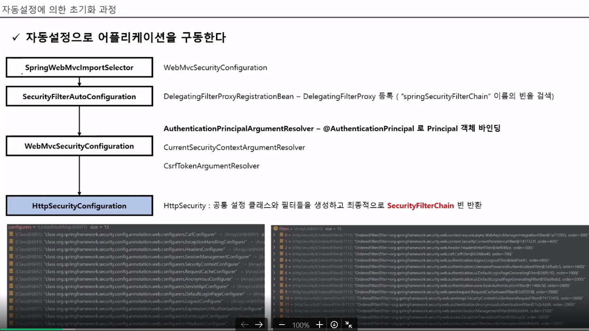

1. `SpringWebMvcImportSelector` 인터페이스를 구현한 구현체가 먼저 실행됨.
   - 만약 A조건일때에는 A설정클래스, B조건일때에는 B설정클래스를 가지고오게 해서 실행 할 수 있게 구체클래스를 설정할 수 있다.
2. `SecurityFilterAutoConfiguration` 클래스는 구현체가 `DelegatingFilterProxy`를 등록하고 등록한 클래스로 `springSecurityFilterChain`이름으로 된 `FilterChainProxy`를 찾는다.
3. `WebMvcSecurityConfiguration` 클래스는 `ArgumentResolver`타입의 클래스를 생성한다.
   - `AuthenticationPrincipalArgumentResolver` 클래스는 @AuthenticationPrincipal로 된 `Principal`객체를 바인딩해준다 —> 메소드 파라미터에 저 어노테이션이 붙어 있으면 SecurityContext에 있는 `Principal` 객체를 자동으로 바인딩 해준다
4. Security 이전 버전에서는 `**HttpSecurityConfiguration**`이라는 클래스가 없었는데, 이 클래스에서 `HttpSecurity`를 생성한다. **Singleton**으로 생성하는 것이 아니라 **prototype**으로 생성한다.
   - 공통 클래스와 필터들을 생성하고 최종적으로 SecurityFilterChain을 반환
   - 각각의 설정클래스들에서 필터들을 생성한다
     - ex) `FormLoginConfigurer` 에서는 `UsernamePasswordAuthenticationFilter`를 생성한다

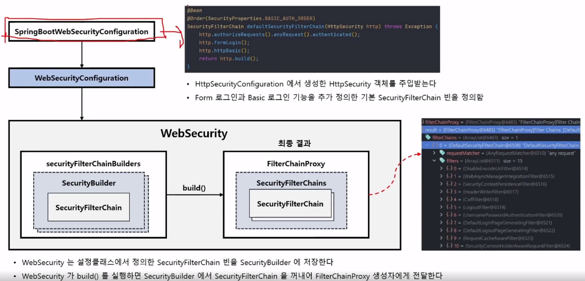

1. `SpringBootWebSecurityConfiguration` 클래스는 `SecurityFilterChain`타입의 Bean을 생성한다. 이 gradle에 의존성을 추가하면 default로 security를 설정해 준다. `SecurityFilterChain`타입을 반환하게 되면 실질적으로 보안을 담당하는 Filter들을 가지고있기 때문에 기본적으로 `formLogin`이나 `HttpBasic`으로 인증하게 화면이 띄어지게 된다.

2. 위에 `**HttpSecurityConfiguration`** 클래스와 함께 기억해야 할 `**WebSecurityConfiguration`** 이다. 이 클래스는 `**WebSecurity**`를 생성한다.
   
   - `**WebSecurity`** 는 `securityFilterChainBuilders`라는 속성이 있는데 이 속성안에 `SecurityBuilder` 클래스또는 익명 클래스가 들어 갈 수 있다. ( 여러개가 들어 갈 수 있다.)
   - `SecurityBuilder` 는 `SecurityFilterChain`을 가지고 있다. `SecurityFilterChain` 이게 5번에서 기본적으로 설정하는 거다.( 커스텀하게 만들 수 있음 )
   - 그리고 나서 `WebSucrity`가 build() 한다. 빌드하면 실제 `WebSecurity`가 생성된다. 최종 결과로 `FilterChainProxy` 객체가 생성되고 그 안에 `SecurityFilterChains` 라는 속성이 있다. 이것도 `SecurityFilterChain` 을 여러개 넣을 수 있다.

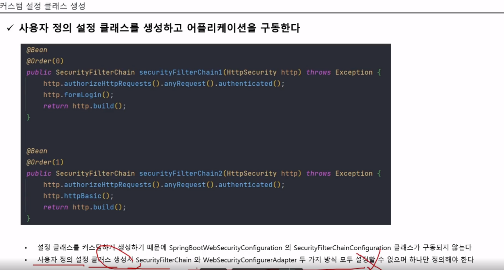

- 커스텀하게 설정하면 위에서 봤던 default SecurityFilterChain은 발동 안함

## 자동설정 기동 과정

1. `SpringWebMvcImportSelector` 가 먼저 실행
   - selectImports라는 메서드 실행됨
     - `DispatchServlet`이 classPath에 잡혀있는지 체크 하고 잡혀있으면 String 으로 `WebSecurityConfiguration`패키지를 리턴해준다. ( build.gradle에 spring web 의존성을 추가 했기 때문에 당연히 DispatchServlet이 있다. )
2. `SecurityFilterAutoConfiguration`
   - `DelegatingFilterProxyRegistrationBean` 을 반환해주는 메소드를 실행하는데, `springSecurityFilterChain`이라는 빈을 찾아 등록해준다.
3. `WebMvcSecurityConfiguration`
   - 앞에 1번에서 반환값으로 `WebSecurityConfiguration` 경로를 String으로 리턴해 주었기 때문에 호출된다.
   - ArgumentResolver타입의 클래스들을 정의하고 추가한다.
4. `HttpSecurityConfiguration`
   - `HttpSecurity` 객체를 빈으로 생성하고 있음 ( 스코프를 prototype으로 )
5. `SpringBootWebSecurityConfiguration`
   - 별도의 설정 클래스를 만들지 않으면 여기서 자동설정으로 만들어 버림
   - `4번에서 HttpSecuriy`클래스를 **DI**받는다
   - 최종적으로 `SecurityFilterChain`을 반환한다.
   - `@ConditionalOnDefaultWebSecurity` 이 어노테이션 안에 값이 true이면 실행하라는 조건이다.
     - `@Conditional(DefaultWebSecurityCondition.class)` 가 선언 되어있다.
       - `@ConditionalOnClass({ SecurityFilterChain.class, HttpSecurity.class })`
       - 현재 클래스에 `SecurityFilterChain.class, HttpSecurity.class` 이것들이 classPath에 잡혀있느냐 체크하는 어노테이션

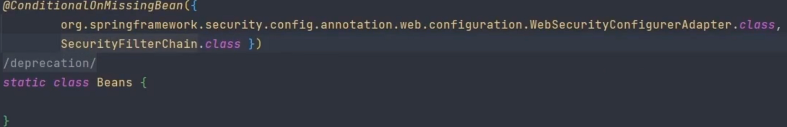

- 위에 그림은 저 조건이 있을 때에는 false를 return 한다. `WebSecurityConfigurerAdapter`클래스는 deprecation되어있고, `SecurityFilterChain` 클래스는 우리가 커스텀하게 만들면 인식하게 되니깐 발동 안함.
- 결론은 커스텀하게 만들면 우리꺼가 사용됨, `WebSecurityConfigurerAdapter` 는 사용하면 안됨
6. `WebSecurityConfiguration`
   - WebSecurity를 만드는 설정 클래스
7. 최종 적으로 build가 되면 FilterChainProxy를 반환한다.

# AuthenticationEntryPoint 이해

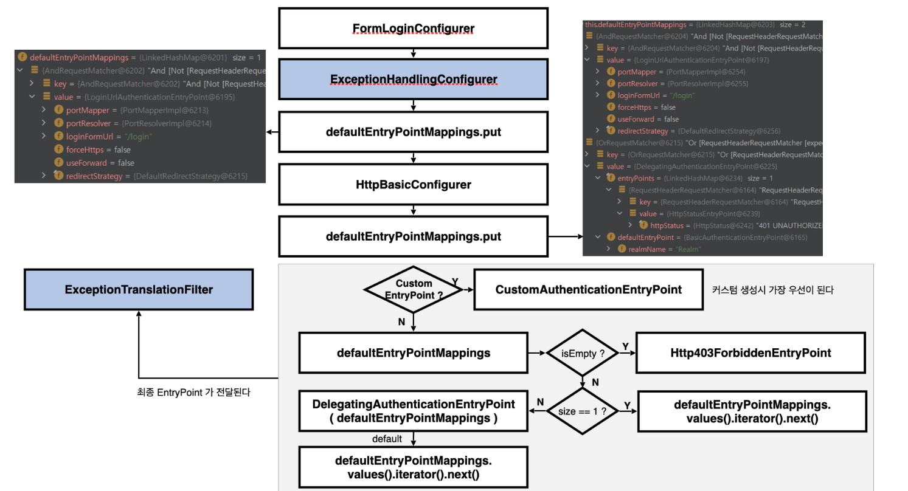

- Security는 실행이 되면 기본적으로 별도의 설정이 없으면 `FormLogin방식`과 `HttpBasic방식`을 설정하고 시작한다.
- 어떠한 방식으로 실행이 되든 당연히 `인증예외`가 발생할 수 있다. 그래서 각각의 방식에 맞는 `AuthenticationEntryPoint`가 지정되어 있어야 한다.
- `**ExceptionHandlingConfigurer**` 클래스가 **인증예외**가 발생 시(권한 X,인가 X) 예외를 관장하는 클래스임.
- 기본적으로 Custom한 AuthenticationEntryPoint가 없으면 default를 만들어서 넣어줌.
- 최종적으로 `ExceptionTranslationFilter`에게 EntryPoint가 전달된다.
- 아무런 인증방식(form, httpbasic)을 설정하지 않으면 `Http403ForbiddenEntryPoint`가 설정됨
- 만약 설정 클래스를 만들지 않고 기본적으로 Seurity가 두개의 인증 방식을 설정했다면 각각의 인증 방식에 맞는 AuthenticationEntryPoint를 만든다. 만약 Custom하게 AuthenticationEntryPoint를 만들었으면 최종적으로 Custom한 것이 전달 됨. 근데 우리가 안만들었으면 Form인증인지 httpBasic인증방식인지 체크하고 그에 맞는 AuthenticationEntryPoint를 넘겨준다.

## 실습

```java
@EnableWebSecurity
public class SecurityConfig {

    @Bean
    SecurityFilterChain securityFilterChain(HttpSecurity http) throws Exception {
        http.authorizeRequests().anyRequest().authenticated();
        return http.build();
    }
}
```

- 아무것도 설정을 안했을 때에는 밑에 그림처럼 403 Forbidden이 뜸
  
  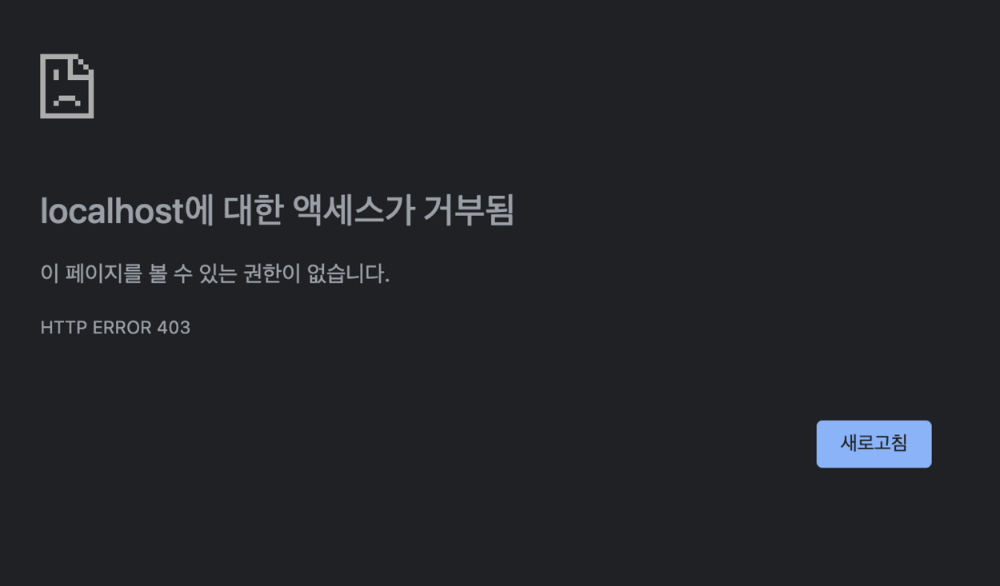

```java
@EnableWebSecurity
public class SecurityConfig {

    @Bean
    SecurityFilterChain securityFilterChain(HttpSecurity http) throws Exception {
        http.authorizeRequests().anyRequest().authenticated();
                http.formLogin();
        return http.build();
    }
}
```

- 아래 그림처럼 FormLoign 방식으로 잡힌 AuthenticationEntryPoint로 이동함

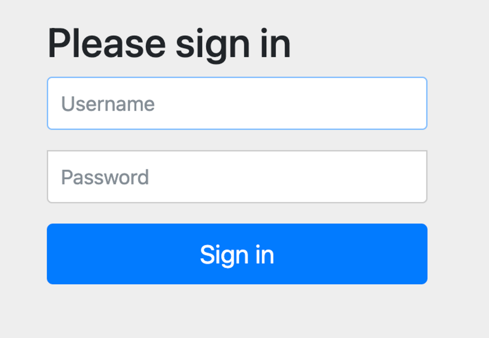

```java
@EnableWebSecurity
public class SecurityConfig {

    @Bean
    SecurityFilterChain securityFilterChain(HttpSecurity http) throws Exception {
        http.authorizeRequests().anyRequest().authenticated();
//        http.formLogin();
        http.httpBasic();
        return http.build();
    }
}
```

- httpBasic방식에서는 밑에 그림처럼 설정되어있음.

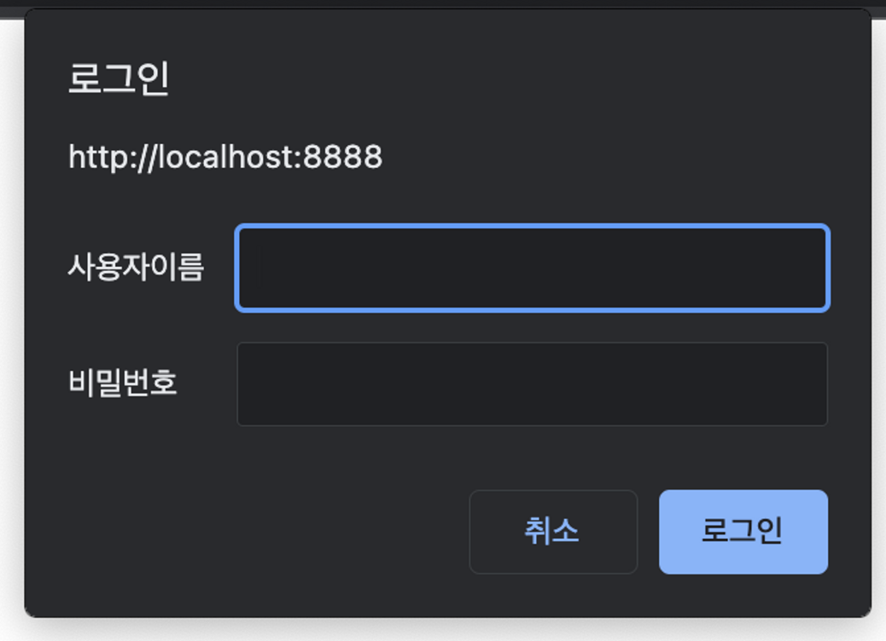

```java
@EnableWebSecurity
public class SecurityConfig {

    @Bean
    SecurityFilterChain securityFilterChain(HttpSecurity http) throws Exception {
                http.authorizeRequests().anyRequest().authenticated();
//        http.formLogin();
//        http.httpBasic();
        http.exceptionHandling().authenticationEntryPoint(new AuthenticationEntryPoint() {
            @Override
            public void commence(HttpServletRequest request, HttpServletResponse response, AuthenticationException authException) throws IOException, ServletException {
                System.out.println("custom entryPoint");
            }
        });
        return http.build();
    }
}
```

- custom하게 만들어 놓고 실행하면 밑에 콘솔창에 그림처럼 나온다
  
  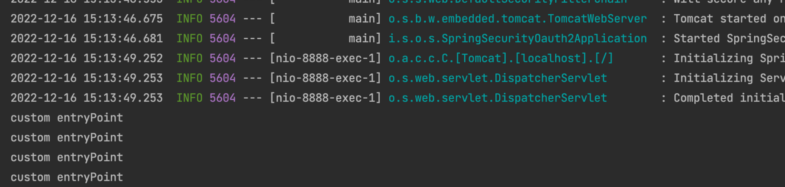
  
  - 위에 주석 두개 풀고 해도 내가 만든 custom한 것이 적용되어있다.
  - 만약 저기서 주석 두개 풀고 custom한것을 주석하고 실행하면 formLogin인증 방식으로 실행된다. 왜나하면 Security가 웹에서 실행한것은 FormLogin으로 처리하기 때문이다.

- 결론적으로 AuthenticationEntryPoint는 인증에 실패했을 경우에 후속작업을 하기위한 것.


# 기본 요소 이해

## 시큐리티 인증 및 인가 흐름 요약

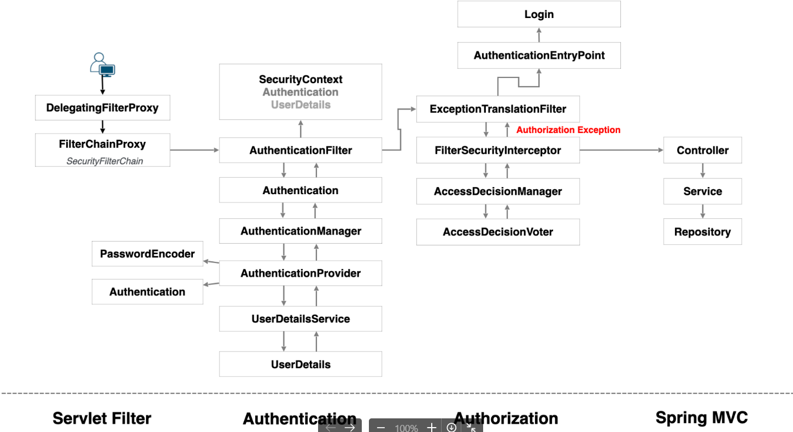

- 사용자 요청이 처음 들어오면 DelegatingFilterPorxy가 먼저 받는다. (Servlet Container == WAS)
  - WAS에서는 Spring의 핵심기능을 사용하지 못한다.
  - DelegatingFilterPorxy는 단지 요청을 받고 전달만 해주고 FilterChainProxy가 전달 받아서 Filter역할과 Spring주요 기능을 다 사용할 수 있게 된다.
- Authentication단계에서 인증이 성공하든 실패하든 AuthenticationFilter로 돌아가서 성공하면 SecurityContext에 Authentication객체를 저장하고 전역적으로 사용가능 할 수 있게된다.


## HttpBasic 인증

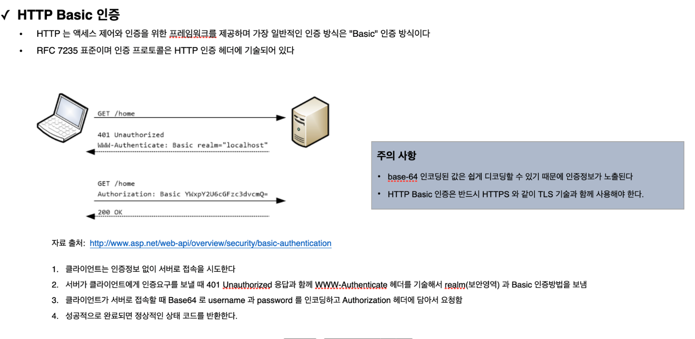

- HttpBasic 인증은 단순히 id와 pw를 basic encoding하여 보내는 것이다.
- base-64 인코딩된 값은 쉽게 디코딩할 수 있기 때문에 반드시 HTTPS와 같이 TLS 기술과 함께 사용해야 한다.

### HttpBasicConfigurer

- HTTP Basic인증에 대한 초기화를 진행하며 속성들에 대한 기본값들을 설정한다.
- 기본 `AuthenticationEntryPoint`는 `BasicAuthenticationEntryPoint`이다.
  - 클라이언트한테 에러 인증 처리 함
- 필터는 BasicAuthenticationFilter를 사용한다.

### BasicAuthenticationFilter

- 이 필터는 기본 인증 서비스를 제공하는 데 사용됨
- `BasicAuthentiacationConverter`를 사용해서 요청 헤더에 기술된 인증정보의 유효성을 체크하며 Base64 인코딩된 username과 password를 추출한다.
- 인증이 성공하면 Authentication 이 SecurityContext에 저장되고 인증이 실패하면 Basic인증을 통해 다시 인증하라는 메시지를 표시하는 BasicAuthenticationEntryPoint가 호출된다.
- 인증 이후 세션을 사용하는 경우와 사용하지 않는 경우에 따라 처리되는 흐름에 차이가 있다.
  - 세션을 사용하는 경우 매 요청 마다 인증과정을 거치지 않으나 세션을 사용하지 않는 경우 매 요청마다 인증과정을 거쳐야 한다.


- 요청이 들어오면 Filter와 Converter를 거치고 Token에 username, password를 저장하고 인증 할지 말지 여부 선택하고 인증 진행, 실패하면 EntryPoint가 처리

## Cors 이해

### Simple Request

- 예비 요청 과정 없이 바로 서버에 본 요청을 한 후, 서버가 응답 헤더에 `Access-Control-Allow-Origin`과 같은 값을 전송하면 브라우저가 서로 비교 후 CORS 정책 위반여부를 검사하는 방식
- 간단한 만큼 **제약사항**들이 있다
  - GET, POST, HEAD 중의 한 가지 Method를 사용해야 한다.
  - Custom Header는 허용 안한다.
  - Content-type은 application/x-www-form-urlencoded, multipart/form-data, text/plain만 가능하다.

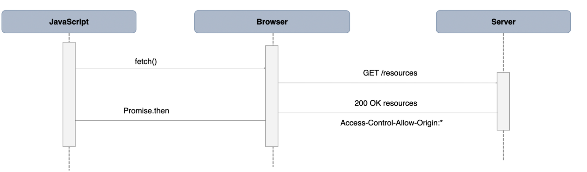

### Preflight Request (예비 요청)

- 브라우저는 요청을 한번에 보내지 않고, **예비요청과 본요청**으로 **나누어** 서버에 전달한다.
- 브라우저가 예비요청을 보내는 것을 Preflight라고 하며 이 예비요청의 메소드에는 OPTIONS가 사용된다.
- 예비요청의 역할은 본 요청을 보내기 전에 브라우저 스스로 안전한 요청인지 확인하는 것**(** **Simple Request의 제약사항에 해당하지 않을 경우 브라우저가 Preflight Request를 실행한다 )**

### CORS해결 - 서버에서 설정

- `Access-Control-Allow-Origin` - 헤더에 작성된 출처만 브라우저가 리소스를 접근할 수 있도록 허용한다
  - *, [](https://security.io/)[https://security.io](https://security.io)
- `Access-Control-Allow-Methods` - preflight request 에 대한 응답으로 실제 요청 중에 사용할 수 있는 메서드를 나타낸다
  - 기본값은 GET,POST,HEAD,OPTIONS, *
- `Access-Control-Allow-Headers` - preflight request 에 대한 응답으로 실제 요청 중에 사용할 수 있는 헤더 필드 이름을 나타낸다
  - 기본값은 Origin,Accept,X-Requested-With,Content-Type, Access-Control-Request-Method,Access-Control-Request-Headers, Custom Header, *
- `Access-Control-Allow-Credentials` - 실제 요청에 쿠기나 인증 등의 사용자 자격 증명이 포함될 수 있음을 나타낸다. Client의 **credentials:include 일경우 true** 필수
- `Access-Control-Max-Age` - preflight 요청 결과를 캐시 할 수 있는 시간을 나타내는 것으로 해당 시간동안은 preflight요청을 다시 하지 않게 된다

### CorsConfigurer

- Spring Security 필터 체인에 CorsFilter를 추가한다.
- corsFilter라는 이름의 Bean이 제공되면 해당 CorsFilter가 사용된다.
- corsFilter라는 이름의 Bean이 없고 `CorsConfigurationSource` 빈이 정의된 경우 해당 `CorsConfiguration`이 사용된다.
- `CorsConfigurationSource` 빈이 정의되어 있지 않은 경우 Spring MVC가 클래스 경로에 있으면 `HandlerMappingIntrospector`가 사용된다.

### CorsFilter

- CORS 예비 요청을 처리하고 CORS 단순 및 본 요청을 가로채고, 제공된 `CorsConfigurationSource`를 통해 일치된 정책에 따라 CORS 응답 헤어와 같은 응답을 업데이트하기 위한 필터임
- Spring MVC java 구성과 Spring MVC XML 네임스페이스에서 CORS를 구성하는 대안이라 볼 수 있다.
- 스프링 웹에 의존하는 응용 프로그램이나 javax.servlet 에서 CORS 검사를 수행해야 하는 보안 제약 조건에 유용한 필터이다.
