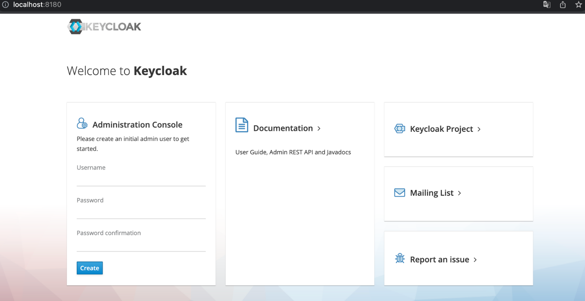
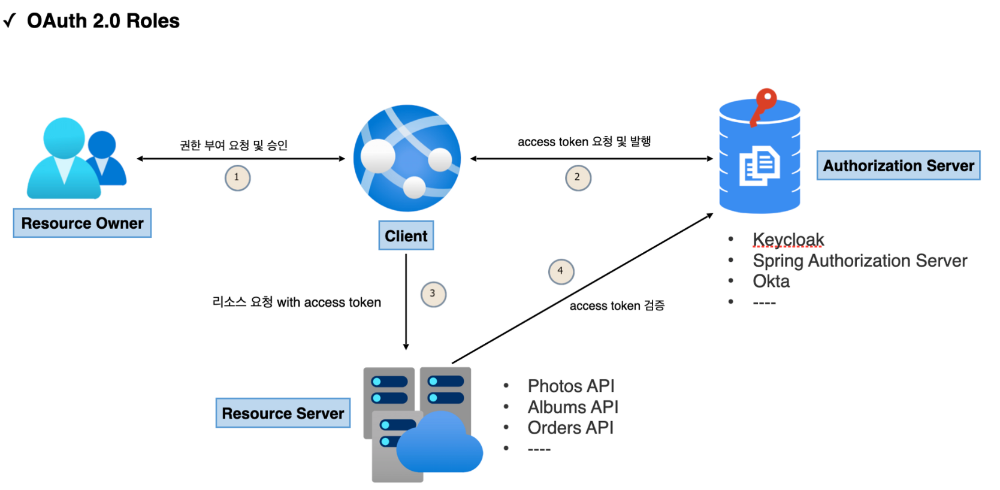
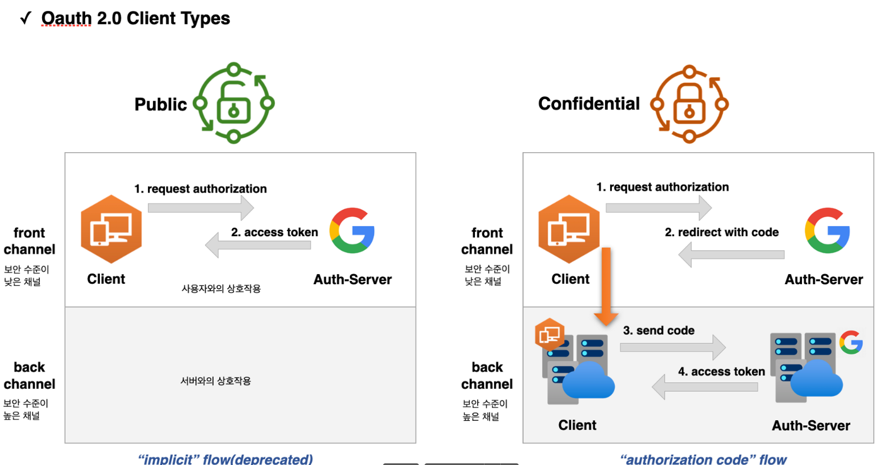
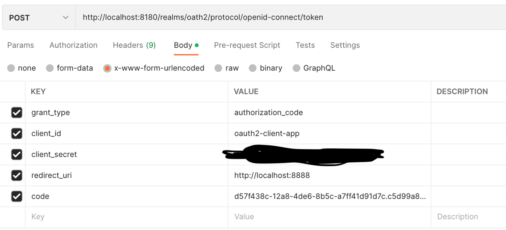

# OAuth 2.0 용어 이해

## OAuth 2.0

- OAuth = Open + Authorization ( 개방형 인가, 권한부여 )
- 애플리케이션이 사용자 대신하여 사용자의 자원에 대한 제한된 엑세스를 얻기 위해 승인 상호 작용을 함으로써 애플리케이션이 자체적으로 엑세스 권한을 얻도록 한다.
- 즉, 사용자가 속한 사이트의 보호된 자원에 대하여 애플리케이션의 접근을 허용하도록 승인하는 것
- 위임 인가 프레임워크라고도 한다.


## keycloak 설치 및 설정

- ID 및 접근 관리를 지원하는 **인가서버 오픈소스**로 사용자 연합, 강력한 인증, 사용자 관리, 세분화된 권한 부여 등을 제공한다.

- [downloads - Keycloak](http://www.keycloak.org/downloads)

- 기본 포트 8080인데 포트 변경 후 실행
  
  ```java
  ./kc.sh start-dev --http-port=8180
  ```



- 위에 페이지에서 admin에 접속할 수 있는 정보를 입력한다.
- id : admin, pw : 1234 —> admin콘솔 들어 갈때
- id : user pw : 1234


## Oauth 2.0 Rules

- OAuth 2.0 메커니즘은 다음 네 가지 종류의 역할을 담당하는 주체들에 의해 이루어지는 권한부여 체계이다.
  1. Resource Owner (자원 소유자)(사용자)
     - 보호된 자원에 대한 접근 권한을 부여할 수 있는 주체, 사용자로서 계정의 일부에 대한 접근 권한을 부여하는 사람
     - 사용자를 대신하여 작동하려는 모든 클라이언트는 먼저 사용자의 허가를 받아야 한다.
  2. Resource Server (보호자원서버)
     - 타사 어플리케이션에서 접근하는 사용자의 자원이 포함된 서버를 의미한다.
     - **엑세스 토큰을 수락 및 검증**할 수 있어야 하며 권한 체계에 따라 요청을 승인할 수 있어야 한다.
  3. Authorization Server (인가 서버)
     - 클라이언트가 사용자 계정에 대한 동의 및 접근을 요청할 때 상호 작용하는 서버로서 클라이언트의 권한 부여 요청을 승인하거나 거부하는 서버
     - 사용자가 클라이언트에게 권한 부여 요청을 승인한 후 access token 을 클라이언트에게 부여하는 역할
  4. Client (클라이언트)
     - 사용자를 대신하여 권한을 부여받아 사용자의 리소스에 접근하려는 어플리케이션
     - 사용자를 권한 부여 서버로 안내하거나 사용자의 상호작용 없이 권한 부여 서버로부터 직접 권한을 얻을 수 있다.




## Oauth 2.0 Client Types

- RFC 6749
- 인증 서버에 클라이언트를 등록할 때 클라이언트 자격 증명인 클라이언트 아이디와 클라이언트 암호를 받음
- 암호는 비밀, 아이디는 공개
- 이 자격 증명은 인증 서버에 대한 클라이언트 ID를 증명한다.

### 기밀 클라이언트

- `client secret`의 **기밀성을 유지할 수 있는 클라이언트**를 의마한다.
- 일반적으로 사용자가 소스 코드에 엑세스할 수 없는 서버에서 실행되는 응용프로그램으로 NET, java, PHP 및 Node JS와 같은 서버 측 언어로 작성된 서버
- 이러한 유형의 애플리케이션은 대부분 웹 서버에서 실행되기 때문에 일반적으로 웹 앱 이라고 한다.

### 공개 클라이언트

- client secret의 기밀을 유지할 수 없으므로 이러한 앱에는 secret이 사용되지 않음.
- 브라우저(SPA)에서 실행되는 JavaScript 애플리케이션, 안드로이드, IOS모바일 앱 등
- Chrome 개발자 콘솔이나 디스어셈블러와 같은 디버깅 도구를 사용하여 기밀 정보 추출이 가능하기 때문에 공개로 간주됨



- Public에서는 front channel에서만 인가 서버와의 상호작용이 일어남
  - client id 로만 access token을 발급 받는다
- Confidential 에서는 front, back 둘다 인가 서버와의 상호작용이 일어남
  1. Client가 인가 서버에게 권한 요청함 (client id로 요청)
  2. 바로 access token을 주는게 아니고 code를 발급해줌 ( 1차보안 느낌? )
  3. back channel에서 인가서버가 발급해준 code와 함께 client secret도 같이 인가 서버에 보낸다. ( 사용자가 접근할 수 없는 영역 )
  4. access 토큰 발급해줌

### 실습

1. 기밀 클라이언트에서 코드 발급하기위해 요청을 보낸다.


- 기본적으로 client_id만 보내고 있음.
2. 코드를 가져왔으면 code와 client_secret을 보낸다. ( 백엔드 단에서 함 )




## Oauth 2.0 Token Types

1. Access Token
   
   - 클라이언트에서 사용자의 **보호된 리소스에 접근하기 위해 사용하는 일종의 자격 증명**으로서 역할을 하며 리소스 소유자가 클라이언트에게 부여한 권한
   
   - 일반적으로 JWT형식을 취하지만 사양에 따라 그럴 필요는 없다.
   
   - 토큰에는 해당 엑세스 기간, 범위 및 서버에 필요한 기타 정보가 있다.
   
   - 타입에는 **식별자 타입(Identifier Type)**과 **자체 포함타입(Self-contained Type)**이 있다.
     
     - **식별자 타입(토큰은 식별자 역할만 함)**
       
       
       
       - 인가서버는 데이터 저장소에 토큰의 내용을 저장하고 이 토큰에 대한 고유식별자만 클라이언트에 다시 발행한다.
       - 이 토큰을 수신하는 API는 토큰의 유효성을 검사하기 위해 인가서버에 대한 백채널 통신을 열고 **DB를 조회**해야 한다.
     
     - **자체 포함 타입(토큰안에 유의미한 정보를 담을 수 있음)**
       
       
       
       - JWT 토큰 형식으로 발급되며 클레임 및 만료가 있는 보호된 데이터 구조
       - 리소스 서버 API가 검증 키 등의 핵심 자료에 대해 알게 되면 발급자와 통신할 필요 없이 자체 포함된 토큰의 유효성을 검사할 수 있다.
       - 특정한 암호화 알고리즘에 의해 개인키로 서명되고 공개키로 검증할 수 있으며 만료될 때까지 유효하다.
   
   - 클라이언트가 Access Token을 가지고 리소스 서버에 접근하고 리소스 서버는 Access Token으로 권한, 검증하여 리소스를 제공한다.

2. Refresh Token
   
   - 엑세스 토큰이 만료된 후 새 액세스 토큰을 얻기 위해 클라이언트 응용 프로그램에서 사용하는 자격 증명
   - 엑세스 토큰이 만료되는 경우 클라이언트는 권한 부여 서버로 인증하고 Refresh Token을 전달한다.
   - 인증 서버는 Refresh Token의 유효성을 검사하고 새 액세스 토큰을 발급한다.
   - Refresh Token은 엑세스 토큰과 달리 권한 서버 토큰 엔드포인트에만 보내지고 리소스 서버에는 보내지 않는다.

3. ID Token

4. Authorization Code
   
   - 권한 부여 코드 흐름에서 사용되며 이 코드는 클라이언트가 **엑세스 토큰과 교환할 임시 코드**임 (1번 이상 사용 안됨)
   - `response_type : code` 를 줄때 리다이렉트로 받아옴
   - 사용자가 클라이언트가 요청하는 정보를 확인하고 인가 서버로부터 리다이렉트 되어 받아온다.
