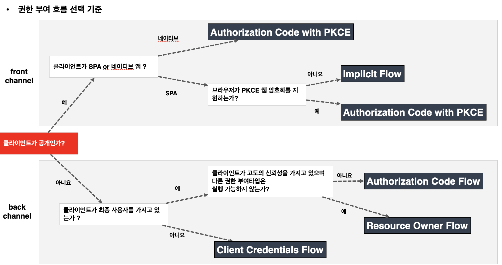

# OAuth 2.0 Grant Type 개요

## 권한 부여 유형

- 클라이언트가 사용자를 대신해서 사용자의 승인하에 인가서버로부터 권한을 부여받는 것을 의미.
- OAuth 2.0 매커니즘은 아래와 같은 권한 부여 유형들을 지원하고 있으며 일부는 Deprecated 되었다.
  1. Authorization Code Grant Type
    - 권한 코드 부여 타입, 서버 사이드 애플리케이션, 보안에 가장 안전한 유형
    - 지금까지 실습한 과정이 이것인데, code를 먼저 받고 그 code를 이용해서 access Token을 얻는 방식
    - `response_type : code`
  2. Implicit Grant Type(2.1에서는 Deprecated)
    - 암시적 부여 타입, **공개 클라이언트** 어플리케이션(SPA 기반 자바스크립트 앱, 모바일 앱), **보안에 취약**
    - 이 타입을 통해서 인가 서버로 부터 access Token을 발급 받는데, 브라우저에 노출이 된다.
    - `response_type : token`
  3. Resource Owner Password Credentials Grant Type(Deprecated)
    - 리소스 사용자 비밀번호 자격증명 부여 타입, 서버 어플리케이션, **보안에 취약**
    - 사용자의 id, pw로 검증
  4. Client Credentials Grant Type
    - 클라이언트 자격 증명 권한 부여 타입, UI or 화면이 없는 서버 어플리케이션
    - client Id, client secret만 있으면 토큰 발급됨, 따라서 사용자가 client임 ( 사용자가 없음 )
    - 데몬이나 서버 to 서버에서 사용 될 수 있음
  5. Refresh Token Grant Type
    - 새로고침 토큰 부여 타입, Authorization Code, Resource Owner Password Type 에서 지원
  6. PKCE-enhanced Authorization Code Grant Type ( proof key code exchange )
    - PKCE 권한 코드 부여 타입, 서버 사이드 어플리케이션, 공개 클라이언트 어플리케이션
    - 1번타입에서 좀 더 강화된 버전

### 권한 부여 흐름 선택 기준

- `front channel`에는 PKCE가 붙어있다 ( 보안에 취약하기 때문 )

### 매개 변수 용어

1. client_id
  - 인가서버에 등록된 클라이언트에 대해 생성된 고유 키
2. client_secret
  - 인가서버에 등록된 특정 클라이언트의 client_id에 대해 생성된 비밀 값
3. reponse_type
  - 애플리케이션이 권한 부여 코드 흐름을 시작하고 있음을 인증 서버에 알려준다.
  - `code, token, id_token` 이 있으며 `token, id_token`은 **implicit 권한부여유형**에서 지원해야 한다.
  - 서버가 쿼리 문자열에 인증코드(code), 토큰(token, id_token)등을 반환
4. grant_type
  - 권한 부여 타입 지정 - authorization_code, password, client_credentials, refresh_token
5. redirect_uri
  - 사용자가 응용 프로그램을 성공적으로 승인하면 권한 부여 서버가 사용자를 다시 응용 프로그램으로 리다이렉트 한다.
  - redirect_uri 가 초기 권한 부여 요청에 포함된 경우 서비스는 토큰 요청에서도 이를 요구해야 한다.
  - 토큰 요청의 redirect_uri 는 인증 코드를 생성할 때 사용된 redirect_uri와 정확히 일치해야한다. 그렇지 않으면 서비스는 요청을 거부해야 한다. ( **만약 client id와 pw가 공격자에 의해 탈취당해도 redirect uri가 애초에 내가 입력한 uri이므로 인가서버가 한번더 체크 가능함** )
6. scope
  - 어플리케이션이 사용자 데이터에 접근하는 것을 제한하기 위해 사용된다 ( email, profile, read, write)
  - 사용자에 의해 특정 스코프로 제한된 권한 인가권을 발행함으로써 데이터 접근을 제한한다.
7. state
  - 응용 프로그램은 임의의 문자열을 생성하고 요청에 포함하고 사용자가 앱을 승인한 후 서버로부터 동일한 값이 반환되는지 확인해야 한다.
  - 토큰 요청 보낼때 state에 문자열을 담아 보낸다. 이때 redirect uri에 state와 code 를 같이 보낸다. 일치하는지 확인할 수 있다.
  - 이것은 CSRF 공격을 방지하는 데 사용된다.
