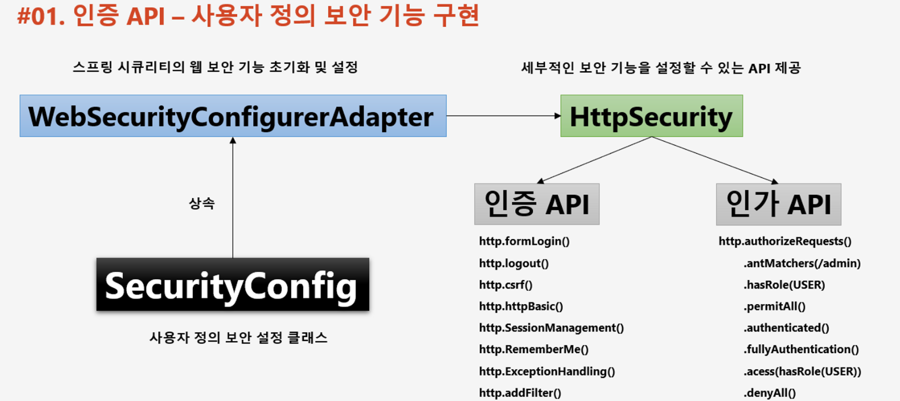
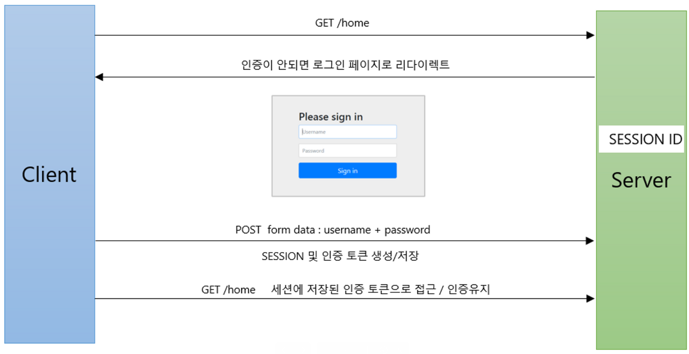

### 1. 스프링 시큐리티 의존성 추가하면

```java
implementation 'org.springframework.boot:spring-boot-starter-security'
implementation 'org.springframework.security:spring-security-test'
```

- 서버가 기동되면 스프링 시큐리티 초기화 작업 및 보안 설정이 이루어 진다.
- 별도의 설정이나 구현을 하지 않아도 기본적인 웹 보안 기능이 작동한다.
  1. 모든 요청은 인증되어야 자원에 접근 가능하다.
  2. 인증방식은 Form 로그인 방식과 httpBasic 로그인 방식을 제공한다.
  3. 기본 로그인 페이지 제공한다.
  4. 기본 계정 한 개 제공한다. ( username : user, password : 램던 문자열 )


### 2. 인증 API - 사용자 정의 보안 기능 구현



```java
@Configuration 
@EnableWebSecurity --(1)
public class SecurityConfig extends WebSecurityConfigurerAdapter { --(2)

    @Override
    protected void configure(HttpSecurity http) throws Exception { --(3)

        http
                .authorizeRequests() --(4)
                .anyRequest().authenticated();
        http
                .formLogin(); --(5)
    }
}
```

1. 보안 관련 애노테이션
2. `WebSecurityConfigurerAdapter` 를 상속 받아야 `HttpSecurity`를 사용할 수 있다
3. configure를 오버라이딩해서 기본 세팅을 해준다. `HttpSecurity`클래스를 이용해 **인증 API** 와 **인가 API** 설정을 해준다
4. **인가 API**
5. **인증 API**


### 3. 인증 API - Form 인증



```java
@Override
protected void configure(HttpSecurity http) throws Exception {

    http
        .authorizeRequests()
        .anyRequest().authenticated();
    http
        .formLogin()
        .loginPage("/loginPage") //사용자 정의 로그인 페이지
        .defaultSuccessUrl("/") //로그인 성공 후 이동페이지
        .failureUrl("/login") //로그인 실패 후 이동페이지
        .usernameParameter("userId") //아이디 파라미터명 설정
        .passwordParameter("passwd") //패스워드 파라미터명 설정
        .loginProcessingUrl("/login_proc") //로그인Form Action Url
        .successHandler(new AuthenticationSuccessHandler() {
            @Override
            public void onAuthenticationSuccess(HttpServletRequest request, HttpServletResponse response, Authentication authentication) throws IOException, ServletException {
                System.out.println("authentication : " + authentication.getName());
                System.out.println("getAuthorities : " + authentication.getAuthorities());
                System.out.println("getCredentials : " + authentication.getCredentials());
                System.out.println("getDetails : " + authentication.getDetails());
                System.out.println("getClass : " + authentication.getClass());
                response.sendRedirect("/");
            }
        })
        .failureHandler(new AuthenticationFailureHandler() {
            @Override
            public void onAuthenticationFailure(HttpServletRequest request, HttpServletResponse response, AuthenticationException exception) throws IOException, ServletException {
                System.out.println("getMessage : " + exception.getMessage());
                System.out.println("getCause : " + exception.getCause());
                System.out.println("getStackTrace : " + exception.getStackTrace());
                System.out.println("getLocalizedMessage : " + exception.getLocalizedMessage());
                System.out.println("getSuppressed : " + exception.getSuppressed());
                response.sendRedirect("/login");
            }
        })
        .permitAll() // 위에 인가API 설정에서 모든 페이지 인가 필요하다 설정하였는데
    ;
}
```
