## 1. 스프링 시큐리티 의존성 추가하면

```java
implementation 'org.springframework.boot:spring-boot-starter-security'
implementation 'org.springframework.security:spring-security-test'
```

- 서버가 기동되면 스프링 시큐리티 초기화 작업 및 보안 설정이 이루어 진다.
- 별도의 설정이나 구현을 하지 않아도 기본적인 웹 보안 기능이 작동한다.
  1. 모든 요청은 인증되어야 자원에 접근 가능하다.
  2. 인증방식은 Form 로그인 방식과 httpBasic 로그인 방식을 제공한다.
  3. 기본 로그인 페이지 제공한다.
  4. 기본 계정 한 개 제공한다. ( username : user, password : 램던 문자열 )

## 2. 인증 API - 사용자 정의 보안 기능 구현


```java
@Configuration 
@EnableWebSecurity --(1)
public class SecurityConfig extends WebSecurityConfigurerAdapter { --(2)

    @Override
    protected void configure(HttpSecurity http) throws Exception { --(3)

        http
                .authorizeRequests() --(4)
                .anyRequest().authenticated();
        http
                .formLogin(); --(5)
    }
}
```

1. 보안 관련 애노테이션
2. `WebSecurityConfigurerAdapter` 를 상속 받아야 `HttpSecurity`를 사용할 수 있다
3. configure를 오버라이딩해서 기본 세팅을 해준다. `HttpSecurity`클래스를 이용해 **인증 API** 와 **인가 API** 설정을 해준다
4. **인가 API**
5. **인증 API**

## 3. 인증 API - Form 인증


```java
@Override
protected void configure(HttpSecurity http) throws Exception {

    http
        .authorizeRequests()
        .anyRequest().authenticated();
    http
        .formLogin()
        .loginPage("/loginPage") //사용자 정의 로그인 페이지
        .defaultSuccessUrl("/") //로그인 성공 후 이동페이지
        .failureUrl("/login") //로그인 실패 후 이동페이지
        .usernameParameter("userId") //아이디 파라미터명 설정
        .passwordParameter("passwd") //패스워드 파라미터명 설정
        .loginProcessingUrl("/login_proc") //로그인Form Action Url
        .successHandler(new AuthenticationSuccessHandler() {
            @Override
            public void onAuthenticationSuccess(HttpServletRequest request, HttpServletResponse response, Authentication authentication) throws IOException, ServletException {
                System.out.println("authentication : " + authentication.getName());
                System.out.println("getAuthorities : " + authentication.getAuthorities());
                System.out.println("getCredentials : " + authentication.getCredentials());
                System.out.println("getDetails : " + authentication.getDetails());
                System.out.println("getClass : " + authentication.getClass());
                response.sendRedirect("/");
            }
        })
        .failureHandler(new AuthenticationFailureHandler() {
            @Override
            public void onAuthenticationFailure(HttpServletRequest request, HttpServletResponse response, AuthenticationException exception) throws IOException, ServletException {
                System.out.println("getMessage : " + exception.getMessage());
                System.out.println("getCause : " + exception.getCause());
                System.out.println("getStackTrace : " + exception.getStackTrace());
                System.out.println("getLocalizedMessage : " + exception.getLocalizedMessage());
                System.out.println("getSuppressed : " + exception.getSuppressed());
                response.sendRedirect("/login");
            }
        })
        .permitAll() // 위에 인가API 설정에서 모든 페이지 인가 필요하다 설정하였는데
    ;
}
```

## 4. 인증 API - UsernamePasswordAuthenticationFilter

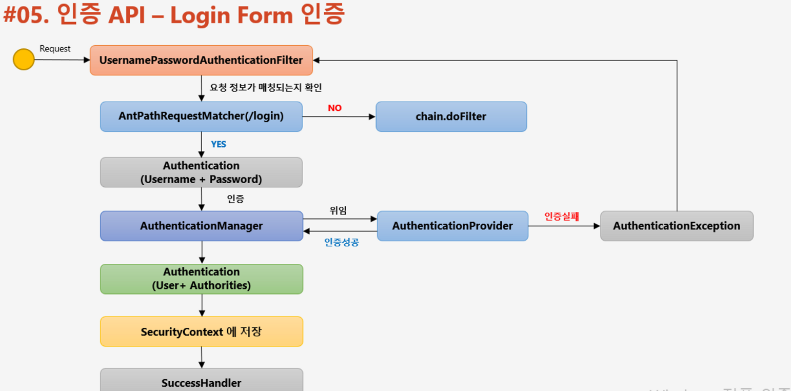

1. /login 이랑 매칭 되는지 확인
2. username + password로 Authentication 객체 만듬
3. Manager를 통해 provider에게 위임하고 실패하면 exception 성공하면 객체를 다시 전달
4. User + Authorities로 같이 합쳐 저장
5. SecurityContext에 저장 ( 전역적으로 다 관리 )

## 5. 인증 API - Logout, LogoutFilter

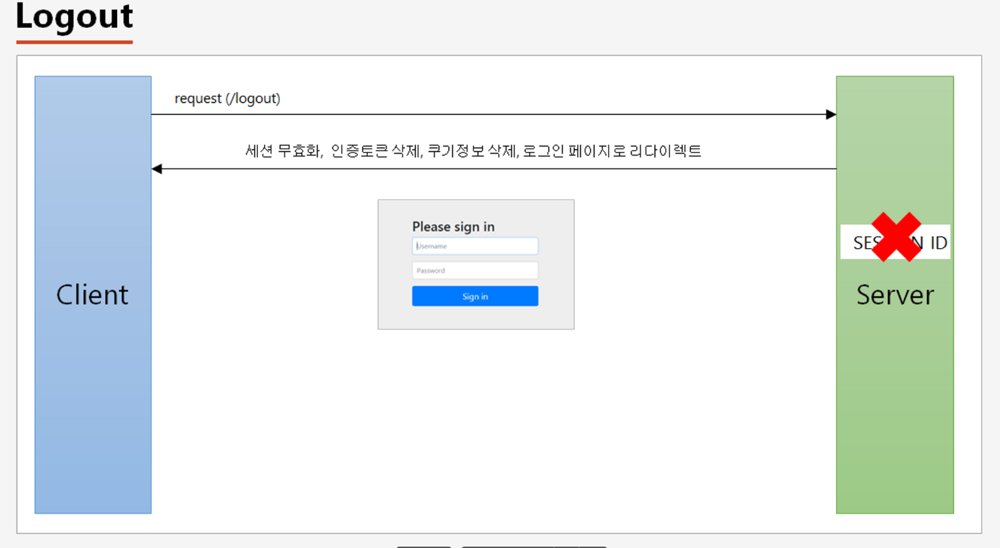

1. request(/logout) 보내면
2. Server에서는 세션 무효화, 인증토큰 삭제, 쿠키정보 삭제, 로그인 페이지로 리다이렉트 해줌

```java
@Override
protected void configure(HttpSecurity http) throws Exception {
      http
        .authorizeRequests()
        .anyRequest().authenticated();
    http
        .formLogin();

      http
        .logout()
        .logoutUrl("/logout")
        .logoutSuccessUrl("/login")
        .addLogoutHandler(new LogoutHandler() {
            @Override
            public void logout(HttpServletRequest request, HttpServletResponse response, Authentication authentication) {
                HttpSession session = request.getSession();
                session.invalidate();
            }
        })
        .logoutSuccessHandler(new LogoutSuccessHandler() {
            @Override
            public void onLogoutSuccess(HttpServletRequest request, HttpServletResponse response, Authentication authentication) throws IOException, ServletException {
                response.sendRedirect("/login");
            }
        })
        .deleteCookies("remember-me");
}
```

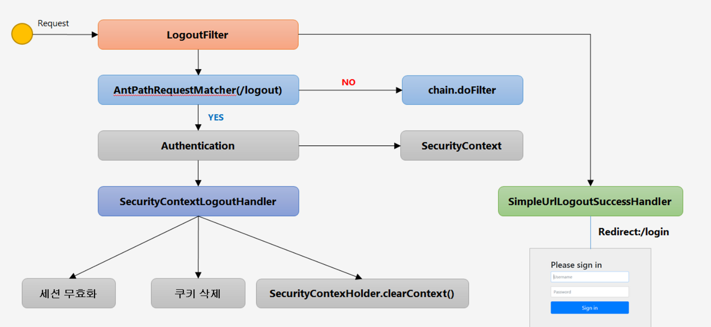

- LogoutFilter → AntPathRequestMatcher(/logout) 실패시 chain.doFilter → Authentication → SecurityContext → SecurityContextLogoutHandler
- 마지막 Handler 에서 세션무효화 ,쿠키 삭제, SecurityContextHandler.clearContext()

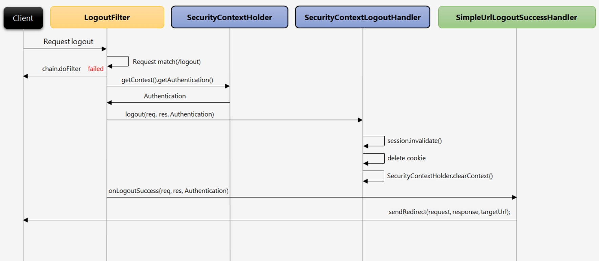

## 6. 인증 API - Remember Me 인증

1. 세션이 만료되고 웹 브라우저가 종료된 후에도 어플리케이션이 사용자를 기억하는 기능
2. Remember-Me 쿠키에 대한 Http 요청을 확인한 후 토큰 기반 인증을 사용해 유효성을 검사하고 토큰이 검증되면 사용자는 로그인 된다.
3. 사용자 라이플 사이클
   - 인증 성공(Remember-Me쿠키 설정)
   - 인증 실패(쿠키가 존재하면 쿠키 무효화)
   - 로그아웃(쿠키가 졵하면 쿠키 무효화)

```java
.rememberMe()
.rememberMeParameter("remember") // 기본 파라미터명은 remember-me
.tokenValiditySeconds(3600) // Default는 14일
.userDetailsService(userDetailsService); 
```

## 7. 인증 API - RememberMeAuthenticationFilter

1. 인증 객체가 없는경우
2. remember-me 쿠키를 가지고 있는 경우
3. jsession 쿠키가 없고 remember-me 쿠키가 있을 경우 발동

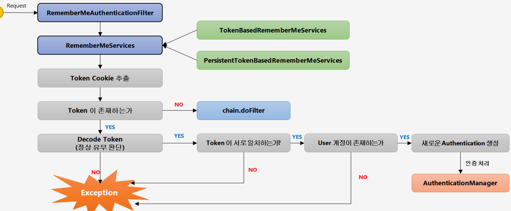

- `TokenBasedRememberMeServices` : 유효기간 설정해서 가지고있음
- `PersistenTokenBasedRememberMeServices` : DB에 저장하여 가지고있음

## 8. 인증 API - AnonymousAuthenticationFilter


- 익명사용자 인증 처리 필터
- 익명사용자와 인증 사용자를 구분해서 처리하기 위한 용도로 사용
- 화면에서 인증 여부를 구현할때 `isAnnonymous()` 와 `isAuthenticated()`로 구분하여 사용
- 인증객체를 세션에 저장하지 않는다.

## 9. 인증 API - 동시 세션 제어 / 세션고정보호 / 세션 정책

- **동시세션**

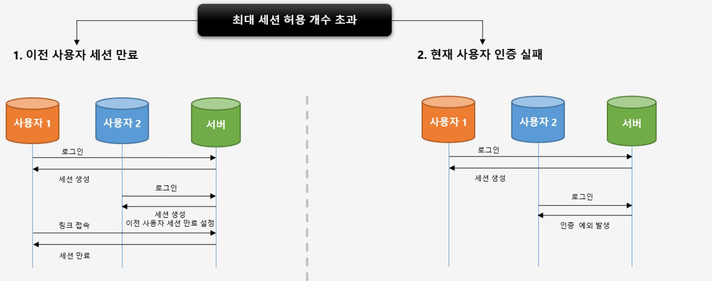

1. 최대 세션 허용 개수를 설정한다. ( 만약 1이라면 )

2. 두 명 이상의 유저가 로그인 한다
- 두가지 경우가 있다.
  1. 이전 사용자 세션을 만료 하는 경우
  2. 현재 사용자 인증을 실패하게 하는 경우

```java
http
      .sessionManagement()   // 세션관리 기능 동작
      .maximumSessions(1)  // 최대 허용 가능 세션 수, -1 : 무제한
      .maxSessionsPreventsLogin(true);  // 동시 로그인 차단(현재 세션 만료)
                                                                                // false : 기존 세션만료
            .invalidSessionUrl("/invalid") // 세션이 유효하지않을때 이동 할 페이지
            .expiredUrl("/expired");  // 세션이 만료될 경우 이동 할 페이지
```

- **세션고정보호**

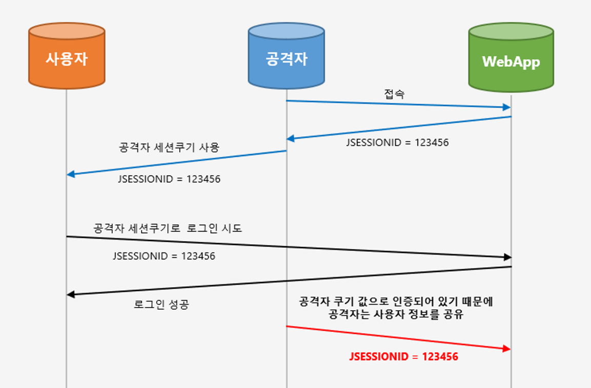

```java
http
.sessionManagement()
.sessionFixation().changeSessionId() //기본값, 세션에 id를 새롭게 변경
.sessionFixation().migrateSession() // 기존에 session에 있던 정보를 새로운 session에 
                                                                        // copy하여 새롭게 만들어서 사용한다.
.sessionFixation().newSession() // 이전에 Session 값을 copy하지 않고 정말 새롭게 
                                                                // session을 만들어서 사용 한다.
.sessionFixation().none() // 아무런 작업도 하지않음.
```

- 세션 정책
  
  ```java
  http
      .sessionManagement()
      .sessionCreationPolicy(SessionCreationPolicy.Always) // 스프링 시큐리티가 항상 세션 생성
      .sessionCreationPolicy(SessionCreationPolicy.If_Required) // 필요시 생성(기본값)
      .sessionCreationPolicy(SessionCreationPolicy.Never) // 생성하지 않지만 이미 존재하면 사용
      .sessionCreationPolicy(SessionCreationPolicy.Stateless) //생성x, 존재 x
  ```

## 11. 인증 API - SessionManagementFilter, ConcurrentSessionFilter

- SessionManagementFilter 먼저 이전 사용자 세션 만료 정책을 설정한 후 `session.expireNow()` 정책에 따라
- ConcurrentSessionFilter는 매 요청마다 세션이 만료되었는지 확인한다. 확인후 로그아웃 그리고 오류페이지
  - `session.isExpired() == true`
    - 로그아웃처리
    - 즉시 오류 페이지 응답

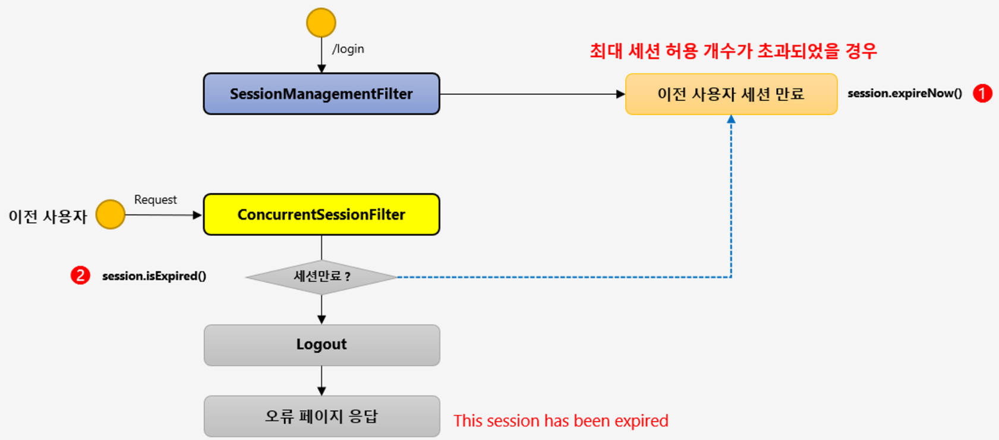

- 이미 이전 사용자가 있으면 SessionManagementFilter 가 expiredNow()를 해서 이전 사용자 세션을 만료 시킨다.
- 이전 사용자가 요청을 시도하면 ConcurrentSessionFilter 가 session.isExpired() 가 동작하여 로그아웃 시킴

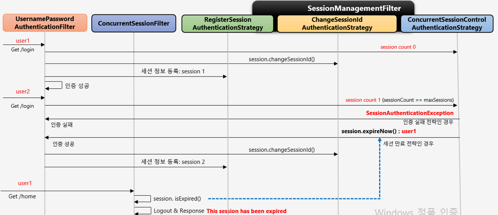

## 12. 인가 API - 권한 설정 및 표현식

- 선언적 방식
  
  - URL
    - `http.antMatchers(”/user/**”).hasRole(”USER”)`
  - Method
    - `@PreAuthorize(”hasRole(’USER’)”)`
    - public void user(){ System.out.println(”user”) }

- 동적 방식
  
  - URL
  - Method

- **선언적 URL 방식**
  
  ```java
  .antMatcher("/shop/**") // url에 접근시 인증 없으면 모든페이지 인증
  .authorizeRequests()
  .antMatchers("/shop/login","/shop/user/**").permitAll() //이 페이지 모든 접속 가능
  .antMatchers("/shop/mypage").hasRole("USER") // 페이지 유저만 가능
  .antMatchers("/shop/admin/pay").access("hasRole('ADMIN')") // ADMIN만 가능
  .antMatchers("/shop/admin/**").access("hasRole('ADMIN') or hasRole('SYS')") //ADMIN or SYS
  .anyRequest().authenticated(); // 나머지 요청은 인증 처리
  ```

- **표현식**
  
  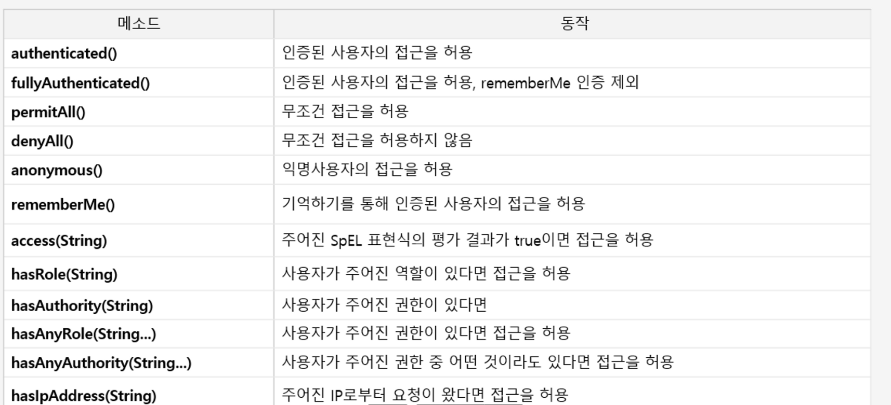

    

- **anonymous() 는 익명 사용자만 혀용 USER 사용자 불가**
- **hasRole(String) : Role_USER 가 있으면 Role_ 은 빼고 넣어야됨 Role을 같이 넣으면 안됨( 프리픽스X)**
- **hasAuthority(String) : 프리픽스 허용**
- **hasAny~~~ : 안에 있는 역할중 하나만 들어와도 허용**

```java
@Override
    protected void configure(AuthenticationManagerBuilder auth) throws Exception {
        auth.inMemoryAuthentication().withUser("user")
                                                                         .password("{noop}1111").roles("USER");
        auth.inMemoryAuthentication().withUser("sys")
                                                                         .password("{noop}1111").roles("SYS","ADMIN");
        auth.inMemoryAuthentication().withUser("admin")
                                                                         .password("{noop}1111").roles("ADMIN","USER","SYS");
    }

    @Override
    protected void configure(HttpSecurity http) throws Exception {

        http
                .authorizeRequests()
                .antMatchers("/user").hasRole("USER")
                .antMatchers("/admin/pay").hasRole("ADMIN")
                .antMatchers("/admin/**").access("hasRole('ADMIN') or hasRole('SYS')")
                .anyRequest().authenticated();
        http
                .formLogin();

    }
```

- 위에는 메모리에 역할을 부여한다. 나중에는 디비에 동적으로 한다
- Matcher도 나중에 동적으로 ㄱㄱ

## 13. 인증/인가 API - 예외 처리 및 요청 캐시 필터

- `FilterSecurityIntercepter` : 제일 마지막에 호출되는 클래스 이자식이 exception을 일으킴, 이 인터셉터 앞에있는 것이 `ExceptionTranslationFilter` 이다. 이것이 try catch 문으로 인터셉터를 감싸고 있어서 인터셉터에서 예외를 던지면 필터가 잡는다
- `**ExceptionTranslationFilter**`
  - `AuthenticationException`
    - **인증 예외 처리**
      1. `AutheticationEntryPoint` 호출
         - 로그인 페이지 이동, 401 오류 코드 전달 등
         - 직접 인터페이스를 구현하면 커스텀하게 처리 가능
      2. 인증 예외가 발생하기 전의 요청 정보 저장
         - user가 **메인페이지** 들어갈 때 로그인을 하지 않아서 거부 당하면 로그인 페이지로 이동하게된다. 이때 **메인페이지**를 저장하고 있다가 로그인하게 되면 바로 메인페이지로 이동 시켜줌
           - **RequestCache 인터페이스** 구현체가 이 역할을 한다- **사용자 요청 이전 정보를 세션에 저장, SavedRequest에서 저장한 값을 세션에 저장해준다**
           - **SavedRequest** : 사용자가 이전에 요청 했던 request파라미터 값들, 그 당시 헤더 값들 저장 ( **실제로 값들이 저장 되는 곳** )
      3. **정리** : `AutheticationEntryPoint` 를 호출해서 로그인 페이지로 이동하게 만들고 요청 전에 정보, 헤더값들을 세션에 담아놓고 필요할때 가져다 쓴다
  - `AccessDeniedExecption`
    - **인가 예외 처리**
      - `AccessDeniedHandler`인터페이스를 구현한 곳 에서 예외 처리하도록 제공

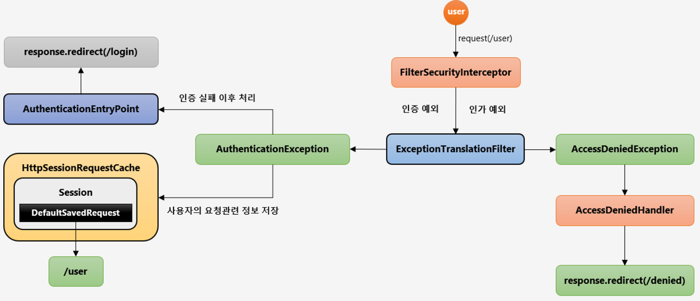

1. 사용자가 인증을 받지않고 /user 자원에 접근한다 가정
2. `FilterSecurityIntercepter` 에서 인가 예외 발생 ( 왜냐면 인증을 받지 않는 유저는 annonymous(**익명사용자, 리멤버미 사용자**)임 )
3. `AccessDeniedExecption` 에서 Handler로 가야되지만 익명사용자나 리멤버미 사용자는`AuthenticationException` 간다.
4. 쉽게 인증 예외로 간다
5. `AuthenticationException` 에서 Security Context에 null로 초기화 시키고 `AutheticationEntryPoint` 로 가서 login 페이지로 가게 한다
6. 이때 그전에 정보를 DefaultSavedRequest 객체안에 저장을 하고 Session에 저장한다. 이 역할을 **HttpSessionRequestCache 가 하게 된다**
7. 다음 사용자는 인증은 받았는데 권한이 없는 경우 인가 예외 발동, 순서대로 간다음 보통 /denied로 가게됨.

## 14. 사이트 간 요청 위조 - CSRF, CsrfFilter

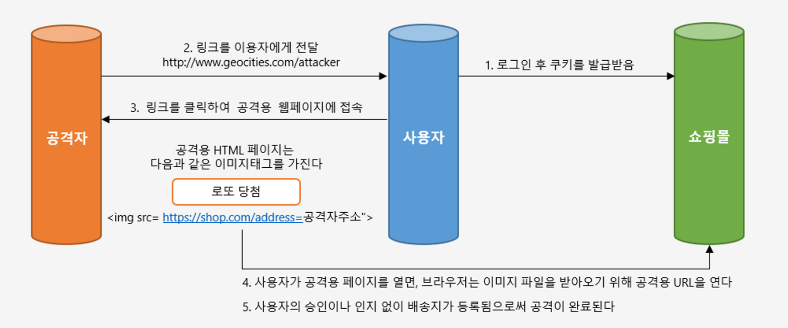

- 모든 요청에 랜덤하게 생선된 토큰을 HTTP파라미터로 요구

- 요청 시 전달되는 토큰 값과 서버에 저장되는 실제 값과 비교한 후 만약 일치하지 않으면 요청은 실패한다.

- **Client**
  
  - `<input type=”hidden” name=”${_csrf.parameterName}” value=”${_csrf.token}” />`
  - HTTP 메소드 : PATCH, POST, PUT, DELETE

- **Spring Security**
  
  - http.csrf() : 기본 활성화 되어있음
  - http.csrf().dsabled() : 비활성화
