## 1. DelegatingFilterProxy, FilterChainProxy

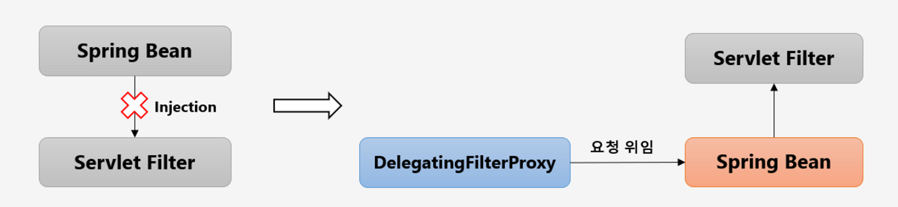

1. 서블릿 필터는 스프링에 정의된 빈을 주입해서 사용 불가
2. 특정한 이름을 가진 스프링 빈을 찾아 그 빈에게 요청을 위임
   - springSecurityFilterChain 이름으로 생성된 빈을 ApplicationContext에서 찾아 요청을 위임
   - 실제 보안처리를 하지 않음

### FilterChainProxy


1. springSecurityFilterChain의 이름으로 생성되는 필터빈
2. DelegatingFilterProxy으로 부터 실제 요청을 위임받고 실제 보안 처리
3. 스프링 시큐리티 초기화 시 생성되는 필터들을 관리하고 제어
   - 스프링 시큐리티가 기본적으로 생성하는 필터
   - 설정 클래스에서 API추가 시 생성되는 필터
4. 사용자의 요청을 필터의 순서대로 호출하고 전달
5. 사용자정의 필터를 생성해서 기존의 필터 전.후로 추가 가능
   - 필터의 순서를 잘 정의해야된다
6. 마지막 필터까지 인증 및 인가 예외가 발생하지 않으면 보안 통과

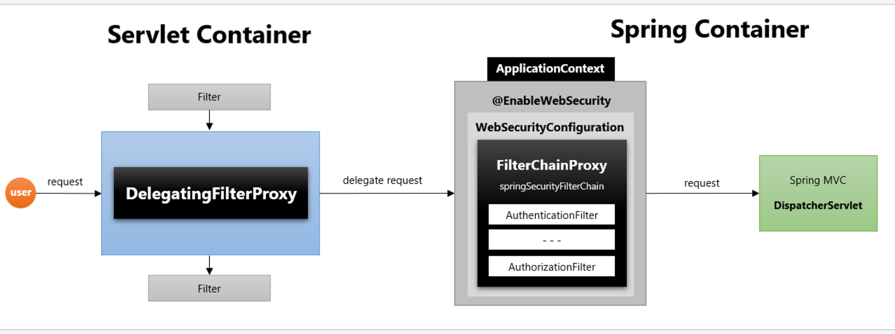

1. DelegatingFilterProxy가 처음으로 요청을 받는다
2. springSecurityFilterChain 이 이름으로 가진 필터를 가져옴 == FilterChainProxy
3. 그 후 FilterChainProxy에 invoke 해서 요청을 위임
4. FilterChainProxy 가 이제 보안 처리를 해야되기 떄문에 getFilter해서 등록되어 있는 Filter들을 list로 가져온다
5. list들을 VirtualFilterChain인 가상 필터체인한테 전달한다. 그리고 순서대로 **보안** 처리해준다
6. 처리완료후 서블릿이나 springMVC로 간다


## 2. 필터 초기화와 다중 보안 설정

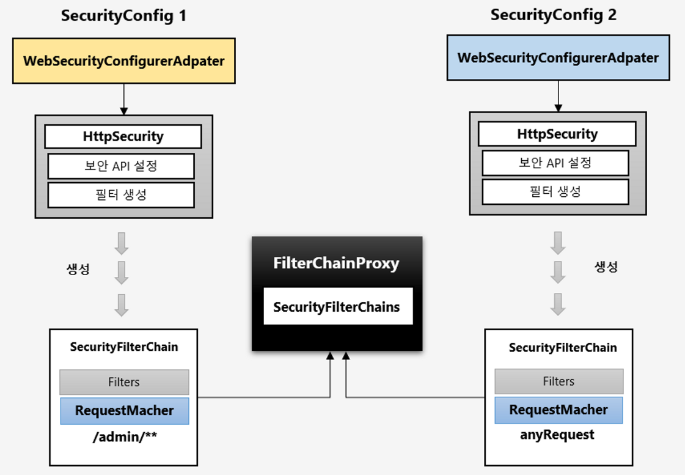

- 설정 클래스 별로 보안 기능이 각각 작동
- 설정 클래스 별로 RequestMatcher 설정
  - http.antMatcher(”/admin/**”)
- 설정 클래스 별로 필터가 생성
- FilterChainProxy가 각 필터들을 가지고 있음 ( 밑에 2번째 과정 )
- 요청에 따라 RequestMatcher와 매칭되는 필터가 작동함

```java
@Configuration
@EnableWebSecurity
@Order(0) //두개 이상의 설정이면 항상 순서를 정해줘야 된다.
public class SecurityConfig_02_02 extends WebSecurityConfigurerAdapter {

    @Override
    protected void configure(HttpSecurity http) throws Exception {

        http
                .antMatcher("/admin/**")
                .authorizeRequests()
                .anyRequest().authenticated()
        .and()
                .httpBasic();

    }
}

@Configuration
@Order(1) // 만약 순서를 바꾸면 안된다. 넓은 범위를 뒤에 놔야됨, 좁은범위가 넓은범위에 십힘
class SecurityConfig_02_02_2 extends WebSecurityConfigurerAdapter {

    @Override
    protected void configure(HttpSecurity http) throws Exception {
        http
                .authorizeRequests()
                .anyRequest().permitAll() // 어떤 요청이든 허용
                .and()
                .formLogin();
    }
}
```

1. `WebSecurity`에 들어가서 `FilterChainProxy`를 생성하면서 `securityFilterChains` 라는 객체를 전달해준다
2. 이 객체는 두 개의 설정 정보가 들어가있는데, 경로 설정한 `requestMatcher`라는 변수에 각각`(”/admin/**")` 와 `any request`가 들어가있고 각각 filter가 들어가 있다. 전자는 `httpBasic`이라12개후자는 `formLogin`이라 password와 디폴트 경로설정 등 합쳐서 14개가 들어가 있다.
3. 그 후 루트 URL로 들어가면 가장 먼저 만나는게 FilterChainProxy인데 이떄 getFilters를 하게 된다. 이때 생성자로부터 받은 filterchains가 두개의 필터를 가지고있다. 그걸 getFilters에게 넘겨주고 이것이 요청에따라 매칭이 되는 것을 판별하여 돌려준다.

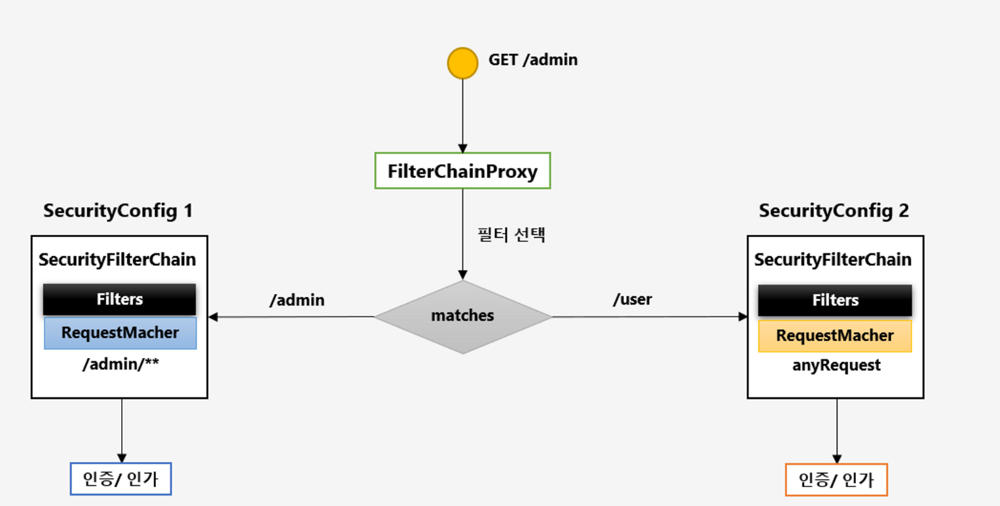

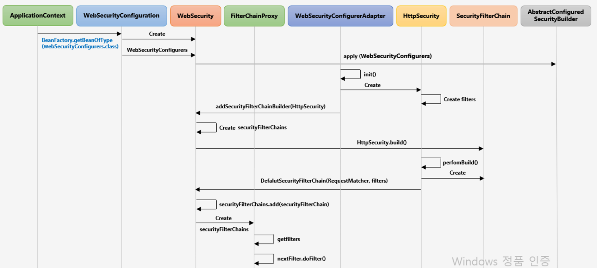


## 3. 인증 개념 이해 - Authentication

**당신이 누구인지 증명하는 것**

- 사용자의 인증 정보를 저장하는 토큰의 개념
- 인증 시 id 와 password를 담고 인증 검증을 위해 전달되어사용된다.
- 인증 후 최종 인증 결과(user객체, 권한 정보)를 담고 SecurityContext에 저장되어 전역적으로 참조가 가능하다
  - `Authentication authentication = SecurityContextHolder.getContext().getAuthentication();`
- 구조
  - princial : 사용자 아이디 혹은 User 객체 저장
  - credentials : 사용자 비밀번호
  - authorities : 인증된 사용자의 권한 목록
  - details : 인증 부가 정보
  - Authenticated : 인증 여부

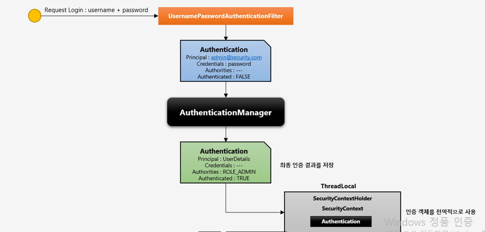

1. 로그인을 한다
2. 인증을 먼저 처리할 수 있는 AbstractAuthenticationProcessingFilter 에 간다(부모격인 인증필터) 그리고나서
3. UsernamePasswordAuthentication에 드간다. id와 password로 토큰을 만들어서 AuthenticationManager에다가 저장한다
4. ProviderManager로 간다 여기서 성공하면 성공 클래스로 간다음
5. 마지막에 AbstractAuthenticationProcessingFilter에서 `SecurityContextHolder.getContext().setAuthentication(authResult)`


## 4. 인증 저장소 - SecurityContextHolder, SecurityContext

### SecurityContext

- `SecurityContext`안에 `Authentication` 객체가 있고 user객체정보가 저장되어있다.
- `Authentication` 객체가 저장되는 보관소로 필요 시 언제든지 Authentication 객체를 쓸 수 있도록 제공되는 클래스
- `ThreadLocal`에 저장되어 아무 곳에서나 참조가 가능하도록 설계함
- 인증이 완료되면 HttpSession에 저장되어 어플리케이션 전반에 걸쳐 전역적인 참조가 가능함

### SecurityContextHolder

- SecurityContext 객체 저장 방식
  - `MODE_THREADLOCAL` : 스레드당 SecurityContext 객체를 할당, **기본값**
  - `MODE_INHERITABLETHREADLOCAL` : 메인 쓰레드와 자식 스레드에 관하여 동일한 SecurityContext를 유지
  - `MODE_GLOBAL` : 응용프로그램에서 단 하나의 SecurityContext를 저장한다.
  - `SecurityContextHolder.setStrategyName(SecurityContextHolder.MODE_INHERITABLETHREADLOCAL);`
- `SecurityContextHolder.clearContext()` : Security 기존 정보 초기화

**인증처리후**

- `Authentication authentication = SecurityContextHolder.getContext().getAuthentication();`
- Authentication객체를 가져올 수 있다.

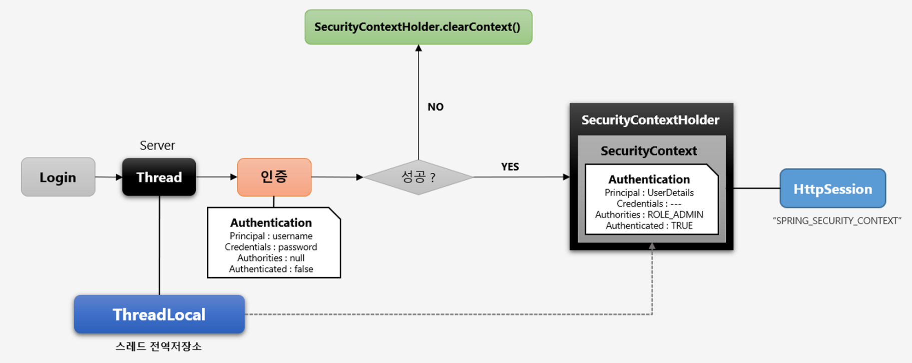

1. 로그인 하면 서버에서 스레드하나 생성 (ThreadLocal에 저장)
2. 인증 하려 하면 Authentication에 유저 정보 실어서 간다
3. 그 와중 실패하면 `SecurityContextHolder.clearContext()` 로 해서 초기화 시킨다.
4. 성공하면 `SecurityContextHolder` 안에 `SecurityContext` 안에 Authentication 인증 객체 담는다

**결론**

- `SecurityContextHolder` 가 `ThreadLocal`객체를 가지고있고 `ThreadLocal`이 `SecurityContext` 를 담고있는다.
- 최종적으로 HttpSession에 저장이 된다. ( `SPRING_SECURITY_CONTEXT` 라는 이름으로 )


## 5. 인증 저장소 필터 - SecurityContextPersistenceFilter

- **SecurityContext 객체의 생성, 저장 조회를 해준다.**

- **익명사용자**
  
  - 새로운 `SecurityContext` 객체를 생성하여 `SecurityContextHolder` 에 저장
  - `AnonymousAuthenticationFilter` 에서 `AnonymousAuthenticationToken` 객체를 `SecurityContext` 에 저장

- **인증 시 ( 인증 시점 )**
  
  - `UsernamePasswordAuthenticationFilter` 에서 인증 성공 후 `SecurityContext`에 `UsernamePasswordAuthenticationToekn` 객체를 `SecurityContext`에 저장
  - 새로운 `SecurityContext` 객체를 생성하여 `SecurityContextHolder` 에 저장
  - 인증이 최종 완료되면 Session에 `SecurityContext`를 저장

- **인증 후 ( 사용자가 인증 후 자원에 접근할 때 )**
  
  - Session에서 `SecurityContext` 꺼내어 `SecurityContextHolder` 에서 저장
  - `SecurityContext` 안에 Authentication 객체가 존재하면 계속 인증을 유지

- **최종 응답 시 공통 ( 익명사용자, 인증시, 인증후에서 응답할 때에 항상 )**
  
  - `SecurityContextHolder.clearContext()` 호출

**결론**

- `SecurityContextPersistenceFilter`는 `SecurityContext` 객체를 생성하여 `SecurityContextHolder` 에 **저장**하는 역할을 한다.
- 수 많은 필터중 두번째로 실행된다.

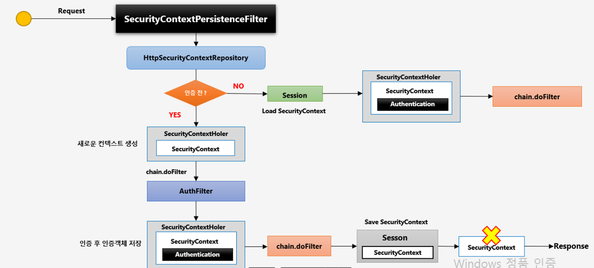

1. 사용자가 요청하면 어떤 요청이든 요청마다 `SecurityContextPersistenceFilter` 발동
2. 내부적으로 `HttpSecurityContextRepository` 클래스가 `SecurityContext` 객체를 생성하고 조회하고 그런 역할을 하는 클래스이다.
3. 인증전에 `SecurityContextHolder` 에 `SecurityContext` 객체를 생성한다.
4. Form 인증 방식이면 UserPasswordAuthenticationFilter가 발동해서 인증 처리
5. 인증필터에서 인증 성공하면 인증객체 저장
6. 최종적으로 Session에 `SecurityContextPersistenceFilter` 가 저장한다
7. Session에 저장 후 `SecurityContextHolder.clearContext()` 호출 해서 초기화 시킴
8. 다시 요청을 하면 인증 후가 된다.
9. 그래서 Session에 Security객체가 있는지 확인하고 꺼내서 저장한다.

**정리**

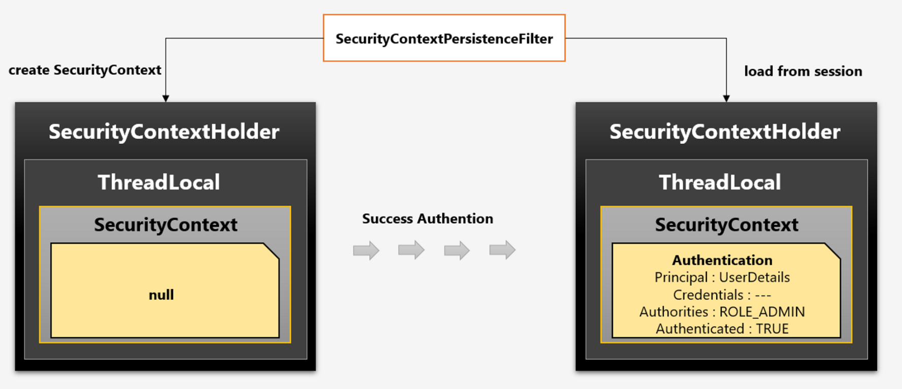

- 인증 전에는 SecurityContext는 null, 인증 후에는 인증객체가있다. Session으로 부터 load 해온다.
- 유저객체(UserDetails)는 Authentication에 저장되어있고, SecurityContext → ThreadLocal → SecurityContextHolder ㅇㅋ?

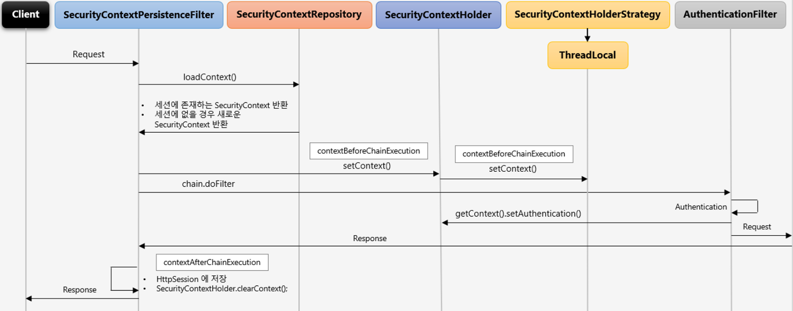


## 6. 인증 흐름 이해 - Authentication Flow


1. client에서 로그인 요청이 들어오면
2. UsernamePasswordAuthenticationFilter 가 발동, Authentication(id + password)객체에 인증 전 객체 토큰 저장 그리고 나서 AuthenticationManager에 인증 처리를 넘긴다.
3. AuthenticationManager 는 인증의 전반적인 처리를 한다. 하지만 실제 인증 처리 역할을 하지않고 적절한 AuthenticationProvider에 위임한다.
4. AuthenticationProvider 가 id 와 password가 맞는지 처리한다
5. 유저 아이디(username)을 가지고 이 객체가 있는지 UserDetailService클래스에 요청한다.
6. Repository에 유저 객체 정보 요청 있으면 가져오고 없으면 예외던짐(UsernamePasswordAuthenticationFilter 가 예외를 받는다 )
7. 객체 정보가 있으면 UserDetail 타입으로 Provider에게 반환한다.
8. Provider가 반환받은 객체와 로그인유저가 준 password를 비교해서 처리
9. 성공 하면 Provider가 Authentication에 최종적으로 성공한 객체를 저장하고 반환 ( UserDetail + authorities) AuthenticationManager에게 전달
10. UsernamePasswordAuthenticationFilter 가 최종적으로 반환받고 SecurityContext객체에 저장


## 7. 인증 관리자 : AuthenticationManager

- 인증 처리하는 filter로부터 인증처리 지시를 받는 첫번째 클래스, ID와 PASSWORD를 Authentication 인증 객체에 저장하고 이 객체를 `AuthenticationManager`에게 전달
- `AuthenticationManager` 인터페이스를 구현한게 `ProviderManager`이다. `AuthenticationProvider`를 관리하는 얘임


- AuthenticationProvider 목록중에서 인증처리 요건에 맞는 AuthenticationProvider를 찾아 인증처리를 위임한다.

- AuthenticationManager는 단지 인증처리를 하지않고 해당에 맞는 Provider를 찾아 위임하는 역할
1. Form인증 요청

2. ProviderManager가 Form 요청에 맞는 DaoAuthenticationProvider 선택 그리고 인증 처리 맡김

3. Oauth인증요청이 들어오면 ProviderManager는 Oauth를 처리 못하니 부모한테 맡긴다.
- ProviderManager는 결국 ID 와 PASSWORD를 가지고 인증객체를 만들어 위임한다

**응용**

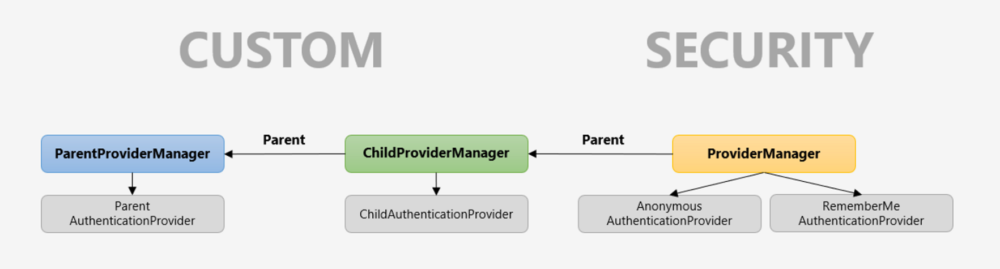

- Linked 형태로 부모와 자식간의 관계를 형성할 수 있다.
- 자식에서 적절한 AuthenticationProvider를 찾지 못할 경우 계속 부모로 탐색하여 찾는 과정을 반복함
- AuthenticationManagerBuilder를 사용해서 스프링 시큐리티의 초기화 과정에서 설정한 기본 Parent 관계를 변경해야 권한 필터에서 재 인증 시 모든 AuthenticationProvider를 탐색 할 수 있다.


## 8. 인증 처리자 - AuthenticationProvider

- 인증 처리할때 가장 핵심적인 역할을 한다.
- id와 password를 검증하는 실질적인 클래스
- manager가 적절한 provider를 선택한다


- AuthenticationProvider는 인터페이스임. 이걸 적절히 implements 받아서 커스텀하게 사용가능
- authenticate 메소드에서 실제적인 인증처리를 한다
- support 메소드는 인증 처리 기준을 정한다
- ID검증은 UserDetailService에서 데이터 계층으로 부터 사용자 계정이 있는지 없는지 조회하고 유저 객체를 생성해서 UserDetails 객체만들어서 반환
- password검증은 로그인시 받았던 비번과 UserDetails에 있는 비번 비교
- 추가 검증 까지 완료하면 Authentication(user, authorities)(유저 정보, 권한 정보)에 담아 Manager에게 보냄


## 9. 인가 개념 및 필터 이해 : Authorization, FilterSecurityInterceptor

- 어떤 사용자가 인증을 받고 어떤 자원을 사용하려 할때 자격 조건이 되는지 판단
- 당신에게 무엇이 허가 되었는지 증명하는 것

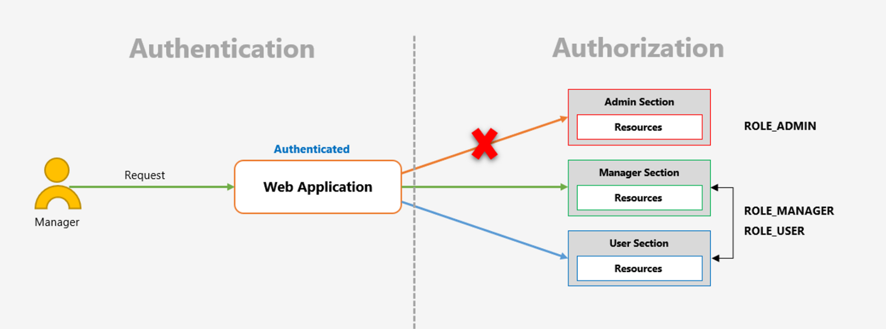

- 첫번째로 시큐리티가 인증 처리를하고 그 다음에 인가 처리한다.

### 시큐리티가 지원하는 권한 계층

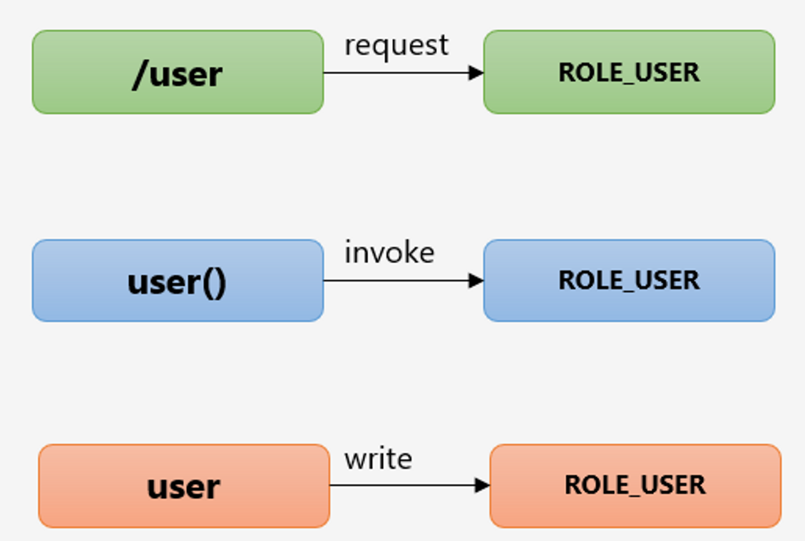

- **웹 계층**
  - **URL 요청**에 따른 메뉴 혹은 화면단위의 레벨 보안
  - `/user` —> ROLE_USER
- **서비스 계층**
  - 화면 단위가 아닌 메소드 같은 기능 단위의 레벨 보안
- **도메인 계층**
  - 객체 단위의 레벨 보안
  - 어떤 객체를 사용할때 권한이 되는지 아닌지??

### FilterSecurityInterceptor

- 마지막에 위치한 필터로써 인증된 사용자에 대하여 특정 요청의 승인/거부 여부를 최종적으로 결정
- 인증객체 없이 보호자원에 접근을 시도할 경우 `AuthenticationException`을 발생
- 인증 후 자원에 접근 가능한 권한이 존재하지 않을 경우 `AccessDeniedException`을 발생
- 권한 제어 방식 중 HTTP자원의 보안을 처리하는 필터
- 권한 처리를 AccessDecisionManager에게 맡김

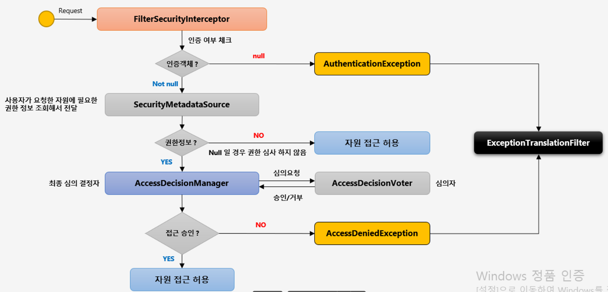

1. 요청이 들오면
2. FilterSecurityInterceptor가 마지막에 받고 인증여부체크를 한다
3. 이떄 인증 객체가 있는지 여부 확인
4. 없으면 `AuthenticationException` 에러발생
5. 그 다음 SecurityMetadataSource 가 사용자가 요청한 URL에 대한 권한 정보를 가져온다. 이때 NULL이면 그 URL은 권한이 없으므로 누구나 접근 허용
6. NULL이 아니면 AccessDecisionManager에게 넘기고 권한 심사함, 최정 심의 결정자임, 내부적으로 AccessDecisionVoter가 심의자임 접근 자격 요건 판단
7. 접근 거부 뜨면 `AccessDeniedException` 예외 발생


## 10. 인가 결정 심의자 - AccessDesicionManager, AccessDesicionVoter

### AccessDesicionManager(인터페이스)

- `FilterSecurityInterceptor`가 전달해준 인증정보, 요청정보, 권한정보를 이용해서 사용자의 자원접근을 허용할 것인지 거부할 것인지를 최종으로 결정하는 주체
- 여러개의 Voter를 가질 수있으며 Voter들로부터 접근허용, 거부, 보류에 해당하는 각각의 값을 리턴받고 판단 및 결정
- 최종 접근 거부 시 예외발생

**구현체**

- **AffirmativeBased**
  - 여러개의 Voter클래스 중 하나라도 접근 허가로 결론을 내면 접근 허가로 판단

    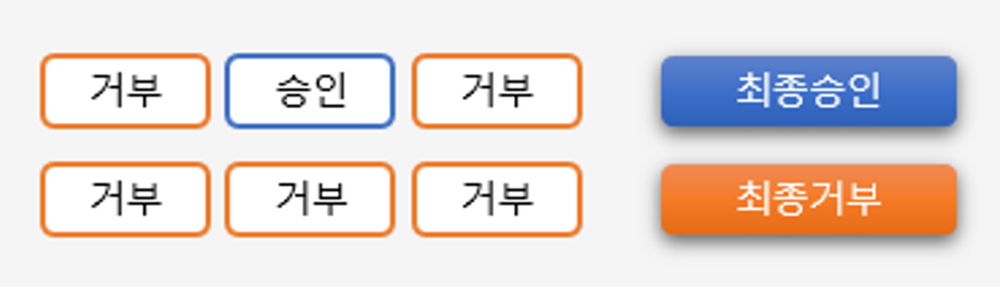

- **ConsensusBased**
  - 다수표에 의해 최종 결정을 판단
  - 동수일경우 기본은 접근 허가, allowIfEqualGrantedDeniedDecisions을 false로 하면 접근 거부

     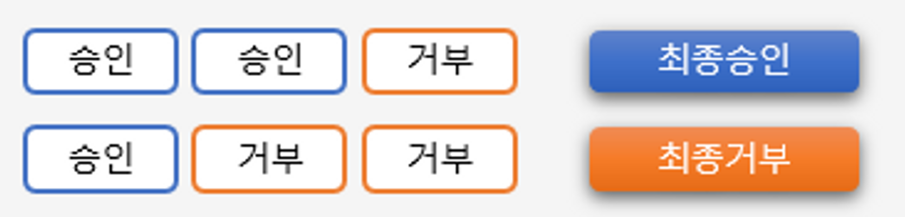

- **UnanimousBased**
  - 모든 보터가 만장일치로 접근을 승인해야 하며 그렇지 않은 경우 접근을 거부한다

    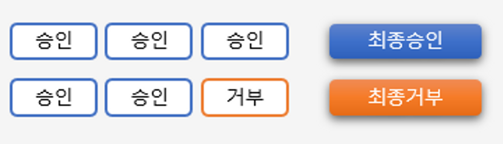

### AccessDecisionVoter

- 판단을 심사하는 것(위원)
- Voter가 권한 부여 과정에서 판단하는 자료
  - **Aauthentication** - 인증정보(user)
  - **FilterInvocation** - 요청정보(antMatcher(”/user”))
  - **ConfigAttributes** - 권한 정보(hasRole(”USER”))
- 결정 방식
  - **ACCESS_GRANTED** : 접근 허용(1)
  - **ACCESS_DENIED** : 접근 거부(-1)
  - **ACCESS_ABSTAIN** : 접근 보류(0)
    - Voter가 해당 타입의 요청에 대해 결정을 내릴수 없는 경우
    - 접근 허용도 아니고 접근 거부도 아닐때

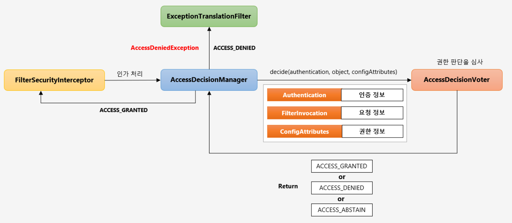

1. `FilterSecurityInterceptor`가 인증 처리후 인증정보, 요청정보, 권한정보를 `AccessDecisionManger`에게 전달한다.
2. 그리고 구현체들에게 3개의 인증정보들을 넘기고 Voter들은 권한 판단 심사를 한다.
3. 최종적으로 거부,승인,보류 중 한개를 리턴받고 Manager가 최종적으로 접근 권한 판단을 한다
4. 승인이 되면 `FilterSecurityIntercepter`한테 ACCESS_GRANTED를 보내준다
5. ACCESS_DENIED받고 거부가 되면 `AccessDeinedException` 예외가 발동하면서 `ExceptionTranslationFilter`가 처리하도록 한다.


## 11. 스프링 시큐리티 필터 및 아키텍처 정리

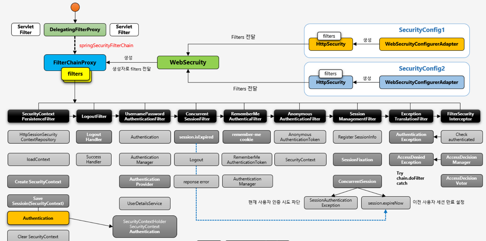

1. SecurityConfig의 설정클래스를 두개 만든다.

2. 설정한 api와 구성대로 Filter들을 생성한다 ( HttpSecurity 클래스가 생성 )

3. 각각의 설정들로 만든 Filter들을 WebSecurity가 받는다

4. WebSecurity가 FilterChainProxy 빈 객체를 생성함, 그때 생성자로 자기가 전달받은 filter들을 전달

5. 이때 DelegatingFilterProxy 서블릿필터가 springSecurityFilterChain라는 빈을 찾는다. 그게 바로 FilterChainProxy이다

6. DelegatingFilterProxy는 사용자가 요청을 하면 받아서 FilterChainProxy를 찾아 위임한다.

7. 여기까지가 초기화 과정
- 사용자가 인증을 시도하는 경우, 인증 후 자원에 접근하는 경우

- 먼저 인증을 시도하는 경우
1. 사용자가 인증을 시도하면 DelegatingFilterProxy가 먼저 요청을 받는다. 그리고 `FilterChainProxy`에게 위임 한다. `FilterChainProxy`는 초기화때 이미 받은 filter를 가지고있고 그것들로 처리한다

2. 먼저 SecurityContextPersistenceFilter가 사용자 요청을 받아서 처리한다.

3. HttpSessionSecurityContextRepository 클래스가 Security 객체를 생성하고 Session에 저장,조회 등을 한다

4. 사용자가 이전에 Security객체를 세션에 저장한 이력이 있는지 체크한다.

5. 없기 떄문에 create SecurityContext 새로운 시큐리티 컨텍스트를 생성한다. ( 처음 인증을 요청을 했거나, annanimous 사용자 일경우 )

6. 그다음 **LogoutFilter** 인데 로그아웃 요청을 하지 않을 경우 특별히 안씀

7. **UsernamePasswordAuthenticationFilter**인데 실질적으로 form 로그인 방식을 처리하는 필터이다

8. Authentication 인증객체를 만들어서 아이디 패스워드를 저장시킨다

9. Authentication Manager 인증 관리자에게 인증 처리를 맡긴다.

10. Authentication Manager가 Authentication Provider 에게 실제 처리를 위임한다

11. Authentication Provider 가 UserDetailService클래스를 활용해서 아이디와 패스워드를 검증한다.

12. 인증이 성공하면 SecurityContextHolder안에 SecurityContext안에 Authentication객체를 생성하고 SecurityContext안에 저장한다.

13. 결국 SecurityContextPersistenceFilter가 생성하고 저장한 객체를 참조를 하는 것이고 인증에 성공한 최종적인 객체를 저장한다

14. 인증객체를 성공적으로 생성하면서 SessionManagementFilter가 동시에 인증처리를 한다.

15. 인증에 성공했다면 ConcurrentSession가 성공한 계정으로 이전에도 요청이 있었는지 체크를 한다. 정책상 동일한 계정으로 로그인을 1개로 제한했다면, 지금은 최초 접속이니 넘어가고

16. SessionFixation(세션고정보호) 인증을 한시점에서 새로운 쿠키가 발급된다. 인증 이전의 쿠키는 없어지고 다시금 세션이 생성되고 쿠키가 발급되도록 한다

17. Register SessionInfo 이제 사용자가 하나 등록되었다.

18. SessionManagementFilter 처리가 인증을 하고 있는 시점에 같이 처리한다.

19. 인증 성공하면 루트페이지로 가는 시점에 다시금 SecurityContextPersistenceFilter가 세션에 최종적으로 인증에 성공한 객체를 저장한다.

20. 인증에 성공한 사용자가 페이지를 요청하면 다시 DelegatingFilterProxy를 통해 요청을 전달받고 SecurityContextPersistenceFilter 필터가 동적하고 load Context가 작동하면서 인증객체를 세션에서 SecurityContext에 저장한다. create SecurityContext를 할 필요없이

21. 마지막 최종적으로 응답을 할때 ClearSecurityContext를 하면서 SecurityContext를 삭제를 한다

22. LogFilter랑 UsernamePasswordAuthenticationFilter는 건너뛰고 Concurrent SessionFilter에 가는데 동일한 계정이 두개 이상일 경우 발동한다(계정정책은 설정하기 나름)

23. RemeberMe AuthenticationFilter는 현재 사용자가 세션이 만료되거나 무효되어서 SecurityContext가 NULL일 경우 작동한다. ( 인증을 받은 사용자에게는 작동안함 )

24. 인증객체가 NULL일 경우에 요청 헤더에 remember me cookie를 담고 있을 경우 동작한다.

25. Anonymous AuthenticationFilter는 사용자가 인증 시도도 하지않고 권한도 없이 어떤 자원에 바로 다이렉트로 접속을 시도할 경우 이필터가 동작

26. Anonymouse Token을 만들어서 SecurityContext객체에 저장하는 역할을 한다. 익명인지 인증인지 필터링 하는 역할

27. SessionManagementFilter 는 현재 SecurityContext가 없거나 Null일 경우 동작한다

28. 이 이후부터는 인증 이후의 큰 역할을 하는 필터 들이다

29. ExceptionTranslationFilter는 인증이나 인가 예외가 발생했을 때 동작

30. FilterSecurityInterceptor 에서 유저 인증부터 체크를 하고 예외가 발생하면 ExceptionTranslationFilter에게 예외를 던진다.

31. 나머지 AccessDecisionManager 와 AccessDecisionVoter에서 인가 예외가 발생 하면 AccessDenied Exception을 던진다

32. 이제 두번째 사용자가 같은 아이디와 패스워드로 인증을 요청한다.

33. UsernamePassword AuthenticationFilter를 거쳐서 인증까지 완료 하고 정책에 따라 처리한다. SessionAuthenticationException은 현재 사용자 인증을 차단을 하고, Session expireNow는 이전 세션 사용자를 만료 시킨다.

34. 만약 expireNow정책을 펼쳐서 이전 사용자 세션을 만료를 시키고 사용자1이 재요청을 할때 ConcurrentSessionFilter가 동작해서 예외를 발생시킨다
