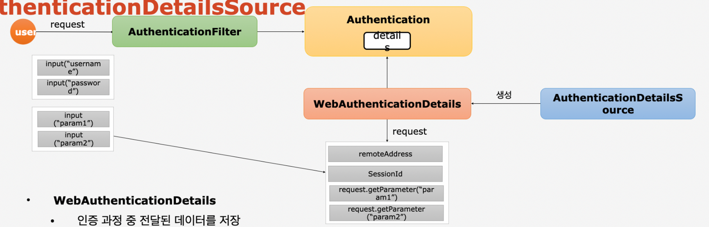

## 1. DB연동 인증 처리 : CustomUserDetailService

1. UserDetailService Interface 를 상속 받는 CustomUserDetailService클래스를 만든다.

2. UserDetails(인터페이스)를 반환하는 `loadUserByUsername` 함수를 오버라이드 한다.

3. UserDetails 인터페이스를 직접 구현해서 커스텀하게 만들 수 있지만 Spring에서 UserDetails를 구현한 클래스 User를 제공한다

4. UserDetails를 구현한 User클래스를 상속 받는 AccountContext를 만든다

5. `loadUserByUsername` 함수에서 DB에서 유저 불러와서 가져온다음, AccountContext에 유저정보와 권한 정보를 넣어준다.
   
   ```java
   List<GrantedAuthority> roles = new ArrayList<>();
   roles.add(new SimpleGrantedAuthority(account.getRole()));
   ```

```java
@Service("userDetailsService")
public class CustomUserDetailService implements UserDetailsService {

    private final UserRepository userRepository;

    public CustomUserDetailService(UserRepository userRepository) {
        this.userRepository = userRepository;
    }

    @Override
    public UserDetails loadUserByUsername(String username) throws UsernameNotFoundException {

        Account account = userRepository.findByUsername(username);

        if (account == null) {
            throw new UsernameNotFoundException("UsernameNotFoundException");
        }

        List<GrantedAuthority> roles = new ArrayList<>();
        roles.add(new SimpleGrantedAuthority(account.getRole()));

        AccountContext accountContext = new AccountContext(account, roles);

        return accountContext;
    }
}
```

### 정리

- 시큐리티로 만든 로그인 처리를 할 때 디비에서 정보를 가져와서 그 사용자가 맞는지 체크해주는 것.
- 로그인 → 디비에서 사용자 정보 가져와 확인 → 권한도 확인 → 인증 처리

## 2. DB연동 인증 처리 : CustomAuthenticationProvider

- 위에서 반환 했던 AccountContext를 가지고 추가 적인 인증 처리를 한다
1. `AuthenticationProvider` 인터페이스를 상속 받는다

2. `authenticate` 와 `supports` 메소드를 오버라이드 한다.

3. `supports` 메소드로 `UsernamePasswordAuthenticationToken` 이랑 파라미터로 전달 받은 Authentication 클래스와 같은 클래스 종류인지 판별하고

4. `authenticate` 에서 UserDetailService를 주입 받고 AccountContext객체를 가져온다음 검수 하고
   
   `UsernamePasswordAuthenticationToken` 객체를 만들어 줘서 반환 시킨다.

```java
public class CustomAuthenticationProvider implements AuthenticationProvider {

    @Autowired
    private PasswordEncoder passwordEncoder;

    @Autowired
    private UserDetailsService userDetailsService;

    @Override
    public Authentication authenticate(Authentication authentication) throws AuthenticationException {

        String username = authentication.getName();
        String password = (String) authentication.getCredentials();

        AccountContext accountContext = (AccountContext) userDetailsService.loadUserByUsername(username);

        if (!passwordEncoder.matches(password, accountContext.getAccount().getPassword())) {
            throw new BadCredentialsException("BadCredentialsException");
        }

        UsernamePasswordAuthenticationToken authenticationToken = new UsernamePasswordAuthenticationToken(accountContext.getAccount(), null, accountContext.getAuthorities());

        return authenticationToken;
    }

    @Override
    public boolean supports(Class<?> authentication) {
        return UsernamePasswordAuthenticationToken.class.isAssignableFrom(authentication);
    }
}
```

- 따라서 기존에 `CustomUserDetailService` 에서는 DB에 있는 정보를 가져와서 있는지 없는지 여부만 체크해 줬고 AccountContext를 반환 하였고, `CustomAuthenticationProvider` 에서는 `CustomUserDetailService` 를 활용해서 `UsernamePasswordAuthentication`에서 주는 `Authentication` 객체와 DB에서 조회하였던 `AccountContext`를 비교하여 로그인 처리를 해준다

## 3. 커스텀 로그인 페이지

```java
.formLogin()
                .loginPage("/login")
                .loginProcessingUrl("/login_proc")
                .defaultSuccessUrl("/")
                .permitAll();
```

## 4. 로그아웃 및 인증에 따른 화면 보안 처리

### 로그아웃 방법

1. <form>태그를 사용해서 POST로 요청
   - 이때 LogoutFilter가 동작해서 실제 로그아웃을 진행

2. <a>태그를 사용해서 GET으로 요청 - SecurityContextLogoutHandler 활용
   
   - 이때는 LogoutFilter가 동작안하고 SecurityContextLogoutHandler 커스텀하여 처리해야됨
- 실질 적으로 LogoutFilter 도 SecurityContextLogoutHandler 를 활용하여 로그아웃 처리함

```java
<li class="nav-item" sec:authorize="isAnonymous()">
    <a class="nav-link text-light" th:href="@{/login}">로그인</a>
</li>

<li class="nav-item" sec:authorize="isAuthenticated()">
    <a class="nav-link text-light" th:href="@{/logout}">로그아웃</a>
</li>

// LoginController.class
@GetMapping("/logout")
public String logout(HttpServletRequest request, HttpServletResponse response) {

    Authentication authentication = SecurityContextHolder.getContext().getAuthentication();

    if (authentication != null) {
        new SecurityContextLogoutHandler().logout(request, response, authentication);
    }

    return "redirect:/login";
}
```

- `SecurityContextLogoutHandler` 는 파라미터가 3개 필요하고, 로그인 되었던 정보는 `SecurityContextHolder.getContext().getAuthentication()` 에서 가져온다

## 5. Form 인증 - WebAuthenticationDetails, AuthenticationDetailsSource



1. 사용자가 인증 요청
2. 기본적으로 username과 password를 담고 있다. `AuthenticationFilter`가
   - 추가적으로 정보를 저장하고 싶으면 `WebAuthenticationDetails`를 활용하여 함, 그리고 `WebAuthenticationDetails`는 `AuthenticationDetailsSource`가 생성한다.
3. `AuthenticationFilter` 가 `Authentication`을 생성하고 기본적으로 id와 password가 저장된다. `Authentication` 는 내부적으로 `details`라는 속성을 가지고 있고 Object 타입이다.(타입과 상관없이 어느 타입이든 저장 가능)
4. details라는 속성에 `WebAuthenticationDetails` 객체를 만들어서 저장
5. `WebAuthenticationDetails` 는 request라는 파라미터를 받아서 parameter값을 저장하고 details라는 속성에 저장된다(remoteAddress와 SessionId는 Security가 처리함)
   - 참고로 `AuthenticationDetailsSource` 가 만든다 `WebAuthenticationDetails` 를

## 6. 인증 성공 핸들러 : CustomAuthenticationSuccessHandler

```java
@Component
@Slf4j
public class CustomAuthenticationSuccessHandler extends SimpleUrlAuthenticationSuccessHandler {

    private RequestCache requestCache = new HttpSessionRequestCache();
    private RedirectStrategy redirectStrategy = new DefaultRedirectStrategy();

    @Override
    public void onAuthenticationSuccess(HttpServletRequest request, HttpServletResponse response, Authentication authentication) throws IOException, ServletException {

        setDefaultTargetUrl("/");

        SavedRequest savedRequest = requestCache.getRequest(request, response);
        if (savedRequest != null) {
            String targetUrl = savedRequest.getRedirectUrl();
            redirectStrategy.sendRedirect(request, response, targetUrl);
        } else {
            redirectStrategy.sendRedirect(request, response, getDefaultTargetUrl());
        }

        Enumeration<String> list = request.getSession().getAttributeNames();
        while (list.hasMoreElements()) {
            log.info("list.nextElement()={}", list.nextElement());
        }

    }
}

// controller

.formLogin()
    .loginPage("/login")
    .loginProcessingUrl("/login_proc")
    .defaultSuccessUrl("/")
    .authenticationDetailsSource(formAuthenticationDetailsSource)
    .successHandler(customAuthenticationSuccessHandler)
    .permitAll();
```

- 로그인 성공 후 동작하는 핸들러
- `.successHandler(customAuthenticationSuccessHandler)`

## 7. 인증 실패 핸들러 : CustomAuthenticationFailureHandler

```java
@Component
public class CustomAuthenticationFailHandler extends SimpleUrlAuthenticationFailureHandler {

    @Override
    public void onAuthenticationFailure(HttpServletRequest request, HttpServletResponse response, AuthenticationException exception) throws IOException, ServletException {

        String errorMessage = "Invalid Username or Password";

        if (exception instanceof BadCredentialsException) {
            errorMessage = "Invalid Username or Password";
        } else if (exception instanceof InsufficientAuthenticationException) {
            errorMessage = "Invalid Secret Key";
        }

        setDefaultFailureUrl("/login?error=ture&exception=" + errorMessage);

        super.onAuthenticationFailure(request, response, exception);

    }
}

//login.html
<div th:if="${param.error}" class="form-group">
  <span th:text="${param.exception}" class="alert alert-danger">에러</span>
</div>

//SecurityConfig
.failureHandler(customAuthenticationFailHandler)

//LoginController
@GetMapping("/login")
public String login(@RequestParam(value = "error", required = false) String error,
                    @RequestParam(value = "exception", required = false) String exception,
                    Model model) {
    model.addAttribute("error", error);
    model.addAttribute("exception", exception);
    return "/user/login/login";
}
```

- UsernamePasswordAuthenticationFilter 에서 에러가 발생하여 FailHandler까지 온다.
- 성공 처리 핸들러랑 비슷함
- 다른점은 에러 정보들을 controller에 넘겨 thymeleaf로 처리 가능

## 8. 인증 거부 처리 : Access Denied

- 인증을 성공하면 인증 필터가 받게 되고, 그 후에 어떤 페이지에 들어 갈 수 있는 권한이 없을 경우 또는 아닌경우 인가 예외가 발생(인증 필터가 처리하지 않음)
- 인가 예외는 필터 중 제일 마지막에 위치하는 `FilterSecurityInterceptor` 가 인가 예외를 발생 시킨다.
- `AbstractSecurityInterceptor`가 처리하고 마지막으로 `ExceptionTranslactionFilter`가 처리한다.
- `ExceptionTranslactionFilter` 안에서 `accessDeniedHandler` 구현체로 처리한다.
- `SecurityConfig` 에 `accessDeniedHandler` 를 설정하여 처리하게 해준다.

**정리**

- 인증 예외는 그 필터가 예외를 발생시키고 인가는 위와의 과정

```java
public class CustomAccessDeniedHandler implements AccessDeniedHandler {

    private String errorPage;

    @Override
    public void handle(HttpServletRequest request, HttpServletResponse response, AccessDeniedException accessDeniedException) throws IOException, ServletException {
        String deniedUrl = errorPage + "?exception= " + accessDeniedException.getMessage();
        response.sendRedirect(deniedUrl);
    }

    public void setErrorPage(String errorPage) {
        this.errorPage = errorPage;
    }
}

// SecurityConfig
.and()
  .exceptionHandling()
  .accessDeniedHandler(accessDeniedHandler())
;
```
